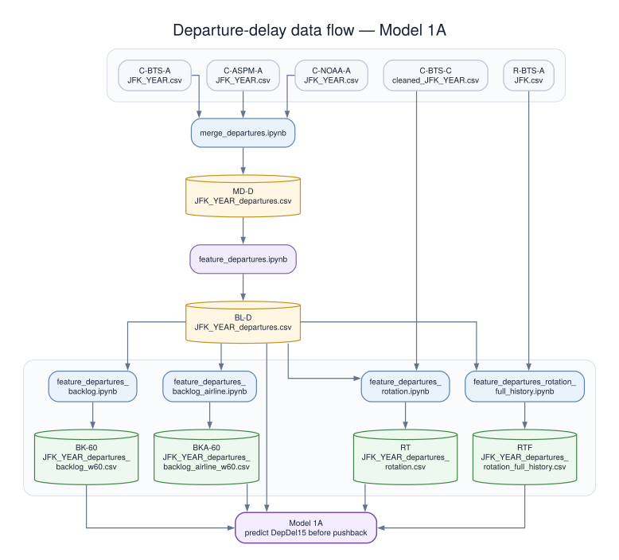

# Appendix C

[Back to the main report](README.md)

This appendix describes the engineered feature datasets, derived from the joined source datasets, and used by the departure
and arrival models. The joined source datasets are documented in [Appendix A](Appendix-A.md) and
[Appendix B](Appendix-B.md#joined-data-column-dictionary).

## Data Understanding

### Datasets

| Dataset code | Dataset description                         | Saved dataset                           |
|---|---------------------------------------------|-------------------------------------------------|
| R-BTS-A | Raw BTS airport-movement dataset for one airport | `bts/raw/YEAR/AIRPORT.csv` |
| C-BTS-A | Cleaned BTS dataset for one airport | `bts/cleaned/AIRPORT_YEAR.csv` |
| C-BTS-C | Consolidated cleaned BTS dataset for JFK arrivals | `bts/cleaned_JFK_YEAR.csv` |
| C-ASPM-A | Cleaned ASPM dataset for one airport | `aspm/cleaned/AIRPORT_YEAR.csv` |
| C-ASPM-C | Consolidated cleaned ASPM dataset for JFK-arrival origin airports | `aspm/cleaned_JFK_YEAR.csv` |
| C-NOAA-A | Cleaned NOAA dataset for one airport | `noaa/cleaned/AIRPORT_YEAR.csv` |
| C-NOAA-C | Consolidated cleaned NOAA dataset for JFK-arrival origin airports | `noaa/cleaned_JFK_YEAR.csv` |
| MD-D | Joined source dataset for JFK departures    | `merged/JFK_YEAR_departures.csv` |
| MD-A | Joined source dataset for JFK arrivals      | `merged/JFK_YEAR_arrivals.csv` |
| BL-D | Baseline JFK departure features             | `features/JFK_YEAR_departures.csv`              |
| BL-A | Baseline JFK arrival features               | `features/JFK_YEAR_arrivals.csv`                         |
| BK-30 | Airport-wide 30-minute departure backlog    | `features/JFK_YEAR_departures_backlog_w30.csv`           |
| BK-60 | Airport-wide 60-minute departure backlog    | `features/JFK_YEAR_departures_backlog_w60.csv`           |
| BKA-60 | Same-airline 60-minute departure backlog    | `features/JFK_YEAR_departures_backlog_airline_w60.csv`   |
| RT | Original limited-history departure rotation | `features/JFK_YEAR_departures_rotation.csv`              |
| RTF | Full-history departure rotation             | `features/JFK_YEAR_departures_rotation_full_history.csv` |

`AIRPORT` and `YEAR` are replaced by the applicable values.

| Production notebook | Source data | Produced dataset code |
|---|---|---|
| `merge_departures.ipynb` | C-BTS-A + C-ASPM-A + C-NOAA-A for flights originating at JFK | MD-D |
| `merge_arrivals.ipynb` | C-BTS-C + C-ASPM-C + C-NOAA-C for flights destined for JFK | MD-A |
| `feature_departures.ipynb` | MD-D | BL-D |
| `feature_arrivals.ipynb` | MD-A | BL-A |
| `feature_departures_backlog.ipynb` | BL-D; the window parameter is run separately for 30 and 60 minutes | BK-30, BK-60 |
| `feature_departures_backlog_airline.ipynb` | BL-D; same-airline cohorts use `Reporting_Airline` | BKA-60 |
| `feature_departures_rotation.ipynb` | BL-D plus C-BTS-C inbound history | RT |
| `feature_departures_rotation_full_history.ipynb` | BL-D plus R-BTS-A airport-movement history | RTF |

### Data Flow

#### Departure-delay data flow: Model 1A

The diagram combines the dataset inventory and production-notebook mapping above. Each dataset node includes its code and saved name. The notebooks transform or extend the datasets; they do not select model features. Appendix D defines the explicit allowlist used by each Model 1A experiment.



The feature notebooks preserve the baseline departure rows and add one feature family. A model experiment can therefore combine fields from BL-D with the matching fields from BK-30, BK-60, BKA-60, RT, or RTF by using its Appendix D allowlist. Training and model selection use 2019, validation uses 2023, and 2024 was held back for final evaluation.

#### Arrival-delay data flow: Models 2A, 2B, and 2C

The diagram uses the dataset codes defined above. Cleaned airport datasets are consolidated for the JFK-arrival origin
airports, joined into MD-A, and transformed into the shared BL-A feature dataset.


BL-A supports all three arrival prediction times. [Appendix D](Appendix-D.md#arrival-model-experiments) defines the
exact allowlist for each experiment and limits each model to information available at its prediction time.

## Baseline Feature Engineering

The baseline feature choices are supported by the three primary references. Snell combines flight records with hourly weather
and emphasizes schedule, airline, route, traffic, and weather. Zoutendijk and Mitici use airline, airport, distance,
scheduled traffic, weather, and time-cycle features. Pineda-Jaramillo et al. combine flight, airport, geographic, and
weather data and examine which fields contribute to predictions.

The project began with this small baseline feature set built from cleaned schedule, airline, route, planned-traffic, and weather
fields. This provided a clear starting point for comparing predictions. Subsequent feature sets were defined to improve
on that baseline by representing time cycles, calendar patterns, route relationships, planned airport demand, and
weather conditions more clearly.

The feature notebooks keep one row per flight. `feature_departures.ipynb` adds 35 common fields to the joined departure
dataset. `feature_arrivals.ipynb` adds the same 35 fields to the joined arrival dataset, followed by nine fields derived
from actual pushback and takeoff information. The resulting departure dataset has 112 columns, and the arrival dataset
has 116 columns.

The table describes how each engineered field is constructed and why it was retained. Raw fields such as
`Reporting_Airline`, `Origin`, `Dest`, `CRSElapsedTime`, `Distance`, the selected NOAA measurements, `WindX`, `WindY`,
and `NOAA_AGE_MINUTES` remain in the feature datasets but are not repeated in this engineered-field dictionary.

### Base Engineered feature dictionary

| Feature | Construction and description | Justification and evidence |
|---|---|---|
| `SCHED_DEP_MINUTE_OF_DAY` | Convert `CRSDepTime` from HHMM to minutes after local midnight. | Provides a valid numeric representation of scheduled departure time. Scheduled time is used by all three primary references, and Pineda identifies time-of-day effects as important. |
| `SCHED_DEP_HOUR` | Integer hour from `SCHED_DEP_MINUTE_OF_DAY`. | Gives an interpretable grouping for EDA and simple models and supports comparison of peak-hour delay rates. Snell discusses scheduled time blocks and peak-hour patterns. |
| `SCHED_DEP_TIME_SIN` | `sin(2π * SCHED_DEP_MINUTE_OF_DAY / 1440)`. | Represents the daily cycle without placing 23:59 far from 00:00. Zoutendijk and Mitici explicitly encode time features with sine and cosine. |
| `SCHED_DEP_TIME_COS` | `cos(2π * SCHED_DEP_MINUTE_OF_DAY / 1440)`. | Completes the cyclical representation of scheduled departure time. |
| `SCHED_ARR_MINUTE_OF_DAY` | Convert `CRSArrTime` from destination-local HHMM to minutes after local midnight. | Captures the scheduled arrival period without implying that origin and destination clocks share a time zone. It must not be subtracted from scheduled departure time; `CRSElapsedTime` is the valid duration field. |
| `SCHED_ARR_TIME_SIN` | `sin(2π * SCHED_ARR_MINUTE_OF_DAY / 1440)`. | Preserves the daily periodicity of the destination-local scheduled arrival time. |
| `SCHED_ARR_TIME_COS` | `cos(2π * SCHED_ARR_MINUTE_OF_DAY / 1440)`. | Completes the cyclical representation of scheduled arrival time. |
| `TIME_OF_DAY` | Interpretable category derived from scheduled departure time, with fixed morning, afternoon, evening, and overnight bands documented before modeling. | Snell discusses time-of-day slots, Pineda uses a departure-period category, and Zoutendijk and Mitici select time of day. This field is especially useful for EDA; a model may use it instead of the sine and cosine pair to avoid repeating the same information. |
| `IS_WEEKEND` | 1 when `DayOfWeek` is 6 or 7; otherwise 0. | Provides a simple weekly schedule distinction. Snell discusses weekend flags, while all three references include or discuss weekday effects. |
| `DAY_OF_WEEK_SIN` | `sin(2π * (DayOfWeek - 1) / 7)`. | Preserves adjacency between Sunday and Monday. Zoutendijk and Mitici explicitly apply trigonometric encoding to day of week. |
| `DAY_OF_WEEK_COS` | `cos(2π * (DayOfWeek - 1) / 7)`. | Completes the weekly cyclical representation. |
| `DAY_OF_YEAR` | Ordinal day from `FlightDate`, from 1 through 365 or 366. | Represents position within the year and is among the schedule features used by Zoutendijk and Mitici. |
| `DAY_OF_YEAR_SIN` | `sin(2π * (DAY_OF_YEAR - 1) / days_in_year)`. | Represents annual seasonality continuously and handles leap years through `days_in_year`. |
| `DAY_OF_YEAR_COS` | `cos(2π * (DAY_OF_YEAR - 1) / days_in_year)`. | Completes the annual cyclical representation. |
| `MONTH_SIN` | `sin(2π * (Month - 1) / 12)`. | Represents month as a cycle. Zoutendijk and Mitici explicitly use month sine and cosine, and Pineda reports month effects. |
| `MONTH_COS` | `cos(2π * (Month - 1) / 12)`. | Completes the monthly cyclical representation. |
| `YEAR_PERIOD` | Treat 2019, 2023, and 2024 as categories rather than as a continuous numeric trend. | Separates the pre-pandemic baseline from the two post-pandemic periods without assuming a steady year-to-year change. Zoutendijk and Mitici use year, but a period category better fits this project's nonconsecutive years. |
| `ROUTE` | Concatenate `Origin` and `Dest` as an origin-destination category. | Preserves the flight-leg identity highlighted by Snell and the airport/destination effects emphasized by Zoutendijk and Mitici and Pineda. |
| `AIRLINE_FLIGHT_ID` | Concatenate `Reporting_Airline` and `Flight_Number_Reporting_Airline`; treat the result as categorical. | Avoids treating a flight number as a continuous quantity and distinguishes identical numbers used by different airlines. Snell and Pineda both retain scheduled flight and airline identity. |
| `AIRLINE_DEST` | Concatenate `Reporting_Airline` and `Dest` as a categorical interaction. | Provides one limited, interpretable service-pattern interaction instead of a large arbitrary interaction set. Airline and destination are supported individually across the primary references. |
| `LOG_DISTANCE` | `log1p(Distance)`. | Retains route-length ordering while reducing right skew. Distance is selected or discussed by all three primary references. The raw distance should remain available for tree models and interpretation. |
| `SCHEDULED_SPEED_PROXY` | `60 * Distance / CRSElapsedTime`, when elapsed time is positive. | Summarizes the relationship between route length and scheduled gate-to-gate duration. It uses only schedule information available before pushback, but should be compared with its two source fields to avoid repeating the same information. |
| `ASPM_PREVIOUS_TOTAL_SCHEDULED_TRAFFIC` | Previous-hour scheduled departures plus previous-hour scheduled arrivals. | Summarizes planned airport workload immediately before the flight. Snell supports airport congestion/traffic measures, and Zoutendijk and Mitici use scheduled-flight counts near the flight time. |
| `ASPM_CURRENT_TOTAL_SCHEDULED_TRAFFIC` | Current-hour scheduled departures plus current-hour scheduled arrivals. | Measures planned workload during the scheduled departure hour. |
| `ASPM_NEXT_TOTAL_SCHEDULED_TRAFFIC` | Next-hour scheduled departures plus next-hour scheduled arrivals. | Measures planned workload just after the scheduled departure hour. These are schedule counts known ahead of time, not future realized outcomes. |
| `ASPM_THREE_HOUR_SCHEDULED_DEPARTURES` | Sum scheduled departures across the previous, current, and next hours. | Provides a three-hour view of planned departure demand, similar to the nearby scheduled-flight window used by Zoutendijk and Mitici. |
| `ASPM_THREE_HOUR_SCHEDULED_ARRIVALS` | Sum scheduled arrivals across the previous, current, and next hours. | Separates planned arrival demand from departure demand because each can load airport resources differently. |
| `ASPM_THREE_HOUR_TOTAL_SCHEDULED_TRAFFIC` | Sum `ASPM_THREE_HOUR_SCHEDULED_DEPARTURES` and `ASPM_THREE_HOUR_SCHEDULED_ARRIVALS`. | Provides the main compact congestion feature supported by Snell's traffic-volume discussion and Zoutendijk and Mitici's scheduled-flight window. |
| `ASPM_CURRENT_MINUS_PREVIOUS_TRAFFIC` | Current-hour total scheduled traffic minus previous-hour total. | Indicates whether planned airport workload is building or easing near departure without using realized performance. |
| `ASPM_NEXT_MINUS_CURRENT_TRAFFIC` | Next-hour total scheduled traffic minus current-hour total. | Shows whether planned demand is expected to rise or fall in the next hour, using schedule information already known at prediction time. |
| `ASPM_MAX_HOURLY_TRAFFIC` | Maximum of the previous-, current-, and next-hour total scheduled traffic. | Captures the local planned peak without imposing a learned high-traffic threshold. |
| `TEMP_DEWPOINT_SPREAD` | `HourlyDryBulbTemperature - HourlyDewPointTemperature`. | Provides a compact moisture-related measure while retaining the underlying observations. Zoutendijk and Mitici select temperature/dew point features, and Snell and Pineda support weather integration. |
| `LOG_PRECIPITATION` | `log1p(max(HourlyPrecipitation, 0))`. | Keeps the difference between trace and heavy precipitation while reducing the influence of a small number of very large values. Snell and Pineda include precipitation-related weather information. |
| `WEATHER_CONDITION_COUNT` | Sum `Rain`, `Drizzle`, `Snow`, `Fog`, `Mist`, `Thunderstorm`, `FreezingPrecip`, and `Showers`. | Gives an interpretable measure of how many adverse condition types are reported without inventing severity weights. |
| `ADVERSE_WEATHER` | 1 when any of the eight weather-condition indicators is 1; otherwise 0. | Supplies a compact general-weather flag for linear baselines while the component indicators remain available. The primary references consistently support weather as a predictor. |
| `ACTUAL_DEP_MINUTE_OF_DAY` | Convert `DepTime` from HHMM to minutes after local midnight. | Represents the known gate-out time once pushback occurs. Snell directly compares arrival-delay models without and with actual departure information. |
| `ACTUAL_DEP_TIME_SIN` | `sin(2π * ACTUAL_DEP_MINUTE_OF_DAY / 1440)`. | Encodes actual pushback time without a midnight discontinuity. |
| `ACTUAL_DEP_TIME_COS` | `cos(2π * ACTUAL_DEP_MINUTE_OF_DAY / 1440)`. | Completes the cyclical representation of actual pushback time. |
| `DEPARTED_EARLY` | 1 when signed `DepDelay` is less than 0; otherwise 0. | Preserves the distinction between early and non-early departures if a nonnegative delay transform is tested. |
| `LOG_DEP_DELAY_MINUTES` | `log1p(DepDelayMinutes)`. | Reduces the influence of very long departure delays while keeping their order. It should be compared with signed `DepDelay` rather than automatically included with every related departure-delay field. |
| `ACTUAL_TAKEOFF_MINUTE_OF_DAY` | Convert `WheelsOff` from HHMM to minutes after local midnight. Treat `2400` as minute zero; invalid or missing values remain missing. | Represents the known takeoff time once the aircraft is airborne without treating HHMM as an ordinary number. |
| `ACTUAL_TAKEOFF_TIME_SIN` | `sin(2π * ACTUAL_TAKEOFF_MINUTE_OF_DAY / 1440)`. | Encodes actual takeoff time without a midnight discontinuity. |
| `ACTUAL_TAKEOFF_TIME_COS` | `cos(2π * ACTUAL_TAKEOFF_MINUTE_OF_DAY / 1440)`. | Completes the cyclical representation of actual takeoff time. |
| `LOG_TAXI_OUT_MINUTES` | `log1p(TaxiOut)` when `TaxiOut` is nonnegative; invalid or missing values remain missing. | Reduces the influence of unusually long taxi-out times for linear models. The original `TaxiOut` value remains available for tree models and interpretation. |

Source timestamps remain in the prepared datasets for audit and joining but are not repeated in this dictionary.

## Operational Backlog Feature Engineering

For a given flight, the airport backlog is a snapshot of flight operations, taken at that flight's scheduled departure time `T`,
before pushback. The backlog looks at other JFK flights scheduled during
`[T - 60 minutes, T)`:

- **Pending count:** flights scheduled earlier but not yet pushed back by `T`. This is the main backlog measure.
- **Completed count:** flights that pushed back before `T`.
- **Mean departure delay:** the average signed delay among those completed flights.

For example, if 20 flights were scheduled in the prior hour, 14 had pushed back, and six had not, the pending backlog is
six flights. The completed count and their mean delay provide context about how effectively JFK was clearing that
traffic. The target flight is excluded. A separate
30-minute version uses the same calculation over a shorter window.

The backlog features are documented separately from the preceding feature dictionary because they were developed as a
project-specific follow-up rather than selected primarily from the reviewed reference papers. They are not presented
as a novel research method. Their purpose is narrower: measure recent realized airport operating state while preserving
the prediction cutoff and keeping all existing feature datasets.

The implementation is deterministic and row preserving. It uses the schedule and gate-out outcomes of other flights to
reconstruct what an operational event feed would have shown at the sample cutoff. It performs no imputation, scaling,
feature selection, or class balancing. Those learned steps remain inside the model pipeline. The window length is a
notebook parameter and is included in the output name and column prefix. The implemented paths use 30 minutes with
prefix `BACKLOG_W30` and 60 minutes with prefix `BACKLOG_W60`.

### Backlog feature dictionary

Let `T` be the sample flight's scheduled departure timestamp. Let the trailing scheduled cohort contain only flights
from the same airport with scheduled timestamps in `[T - 60 minutes, T)`. A cohort flight is *completed* when its actual
gate-out timestamp is earlier than `T`.

| Feature | Construction and description | Missing-value behavior | Availability and purpose |
|---|---|---|---|
| `BACKLOG_W60_SCHEDULED_COUNT` | Number of same-airport flights scheduled during the trailing 60-minute cohort. | Complete integer; zero for an empty cohort. | Planned local workload immediately before the sample cutoff. |
| `BACKLOG_W60_COMPLETED_COUNT` | Cohort flights whose reconstructed gate-out timestamp is strictly before `T`. | Complete integer; zero when none completed. | Recent realized throughput available from gate-out events. |
| `BACKLOG_W60_PENDING_COUNT` | `SCHEDULED_COUNT - COMPLETED_COUNT`; earlier-scheduled cohort flights that have not pushed back by `T`. | Complete integer; zero when none are pending. | Main queue-pressure measure. |
| `BACKLOG_W60_DELAYED_DEPARTURE_COUNT` | Completed cohort flights with `DepDel15 == 1`. | Complete integer; zero when no completed cohort flight is delayed. | Count of recently observed 15-minute departure delays; no pending flight's eventual label is used. |
| `BACKLOG_W60_DELAY_RATE` | `DELAYED_DEPARTURE_COUNT / COMPLETED_COUNT`. | Missing when `COMPLETED_COUNT == 0`. | Recent observed delay frequency. The denominator prevents an empty history from being interpreted as a zero delay rate. |
| `BACKLOG_W60_MEAN_DEP_DELAY` | Mean signed `DepDelay` among completed cohort flights; early departures remain negative. | Missing when `COMPLETED_COUNT == 0`. | Recent signed gate-out performance. |
| `BACKLOG_W60_MEAN_DEP_DELAY_MINUTES` | Mean nonnegative `DepDelayMinutes` among completed cohort flights. | Missing when `COMPLETED_COUNT == 0`. | Recent delay severity without offset from early departures. |
| `BACKLOG_W60_TOTAL_DEP_DELAY_MINUTES` | Sum of nonnegative `DepDelayMinutes` among completed cohort flights. | Complete numeric value; zero when no completed delay minutes are observed. | Accumulated recent completed-flight delay burden. |

The three count fields are intentionally related:

```text
BACKLOG_W60_SCHEDULED_COUNT
    = BACKLOG_W60_COMPLETED_COUNT + BACKLOG_W60_PENDING_COUNT
```

The W30 dataset repeats the same eight definitions with prefix `BACKLOG_W30` and cohort
`[T - 30 minutes, T)`. Its causal boundaries, missing-value behavior, arithmetic identities, and leakage safeguards are
identical; only the trailing duration changes. Both datasets retain all eight fields.

### Same-airline backlog feature dictionary

The same-airline dataset applies the identical cutoff, completion, and delay-observability rules separately within
each normalized `Reporting_Airline`. For a given flight operated by airline `A`, only earlier-scheduled airline `A`
departures in `[T - 60 minutes, T)` enter its cohort. Other airlines never contribute.

Eight fields repeat the airport-wide definitions under the `AIRLINE_BACKLOG_W60` prefix. A ninth field explicitly
represents the fraction of scheduled same-airline work that remains pending:

| Feature | Construction and description | Missing-value behavior |
|---|---|---|
| `AIRLINE_BACKLOG_W60_SCHEDULED_COUNT` | Same-airline flights scheduled in `[T - 60 minutes, T)`. | Complete integer; zero for an empty cohort. |
| `AIRLINE_BACKLOG_W60_COMPLETED_COUNT` | Same-airline cohort flights whose reconstructed gate-out is before `T`. | Complete integer; zero when none completed. |
| `AIRLINE_BACKLOG_W60_PENDING_COUNT` | Same-airline `SCHEDULED_COUNT - COMPLETED_COUNT`. | Complete integer; zero when none are pending. |
| `AIRLINE_BACKLOG_W60_DELAYED_DEPARTURE_COUNT` | Completed same-airline cohort flights with `DepDel15 == 1`. | Complete integer; zero when none qualify. |
| `AIRLINE_BACKLOG_W60_DELAY_RATE` | Delayed count divided by completed count. | Missing when no same-airline cohort flight has completed. |
| `AIRLINE_BACKLOG_W60_MEAN_DEP_DELAY` | Mean signed `DepDelay` among completed same-airline cohort flights. | Missing when none completed. |
| `AIRLINE_BACKLOG_W60_MEAN_DEP_DELAY_MINUTES` | Mean nonnegative `DepDelayMinutes` among completed same-airline cohort flights. | Missing when none completed. |
| `AIRLINE_BACKLOG_W60_TOTAL_DEP_DELAY_MINUTES` | Sum of nonnegative delay minutes among completed same-airline cohort flights. | Complete numeric value; zero when no completed delay minutes are observed. |
| `AIRLINE_BACKLOG_W60_PENDING_SHARE` | `PENDING_COUNT / SCHEDULED_COUNT`. | Missing when the same-airline scheduled cohort is empty. |

### Backlog implementation, validation, and scope

The airport-wide calculations are implemented in
[`feature_engineering_backlog.py`](notebooks/feature_engineering_backlog.py). The same-airline calculations are in
[`feature_engineering_backlog_airline.py`](notebooks/feature_engineering_backlog_airline.py). The production notebooks
and saved dataset names are listed in the [Datasets](#datasets) section. Each output preserves the BL-D flight rows and
their order, then appends one backlog feature family:

| Dataset | Added fields | Total columns | Generated years |
|---|---:|---:|---|
| BK-30 | 8 | 120 | 2019, 2023, 2024 |
| BK-60 | 8 | 120 | 2019, 2023, 2024 |
| BKA-60 | 9 | 121 | 2019, 2023, 2024 |

These reusable datasets retain every generated backlog field. [Appendix D](Appendix-D.md) defines the smaller subsets
used by individual experiments.

The 2024 datasets were generated after the model design was frozen and did not participate in model selection.

The same-airline development datasets were checked for row identity, arithmetic consistency, and identical values for
same-airline flights sharing a scheduled cutoff. Flights from different airlines can have different backlog values at
the same time.

| Year | Flight rows | Reporting airlines | Rows with pending same-airline flights | Mean pending count |
|---:|---:|---:|---:|---:|
| 2019 | 107,430 | 10 | 36,464 | 0.5685 |
| 2023 | 109,983 | 8 | 43,531 | 0.7171 |

Backlog features were not implemented for Models 2A, 2B, and 2C. A valid arrival version would need all departures from
each flight's origin airport, not only the subset traveling to JFK. Each airport would also need to be processed in its
own local scheduled time before the results were combined.

Historical BTS outcomes reconstruct the development snapshots. A deployed Model 1A would instead need a timely JFK
schedule and gate-out event feed. An arrival implementation would need equivalent feeds for every included origin.

## Aircraft Rotation Feature Engineering

Aircraft rotation is the sequence of flights operated by the same aircraft. For a given departure, these features try
to identify the aircraft's preceding inbound flight. They describe whether that aircraft had arrived by the target's
scheduled departure time, how much ground time was available, and what was known about the inbound flight's delay.

[Li](resources/docs/04_Li_DelayPropagationPrediction.pdf) shows that an inbound delay can carry into the same aircraft's
next departure, depending in part on the scheduled turn time. This project uses only the immediately preceding
observable inbound flight, not Li's multi-flight propagation chain.

Let `T` be the target flight's scheduled departure. The target's BTS `Tail_Number` is matched against the airport's
earlier flight movements, with local scheduled and actual times converted to UTC before ordering. The latest known event
for that aircraft determines the rotation state, and the target row contributes no departure or arrival outcome. The RT
dataset uses the original limited airport cohort; the append-only RTF dataset uses the full airport-movement history.
Both add the same 13 predictor fields and eight audit fields, preserve the standard 112 columns and target-row order,
and are saved as `JFK_YEAR_departures_rotation.csv` and `JFK_YEAR_departures_rotation_full_history.csv`.

### Rotation feature dictionary

| Feature | Construction and description | Missing-value behavior | Availability and purpose |
|---|---|---|---|
| `ROTATION_STATUS` | Categorical state: `ARRIVED`, `NOT_ARRIVED`, `NO_PRIOR_EVENT`, `PREVIOUS_EVENT_DEPARTURE`, or `MISSING_TAIL`. | Complete category. | Compact description of rotation coverage and the assigned aircraft's observable state at `T`. |
| `ROTATION_MATCH_FOUND` | 1 when the immediately preceding known tail event is an inbound arrival; otherwise 0. | Complete binary indicator. | Distinguishes a true zero or observed value from the absence of a usable rotation match. |
| `ROTATION_INBOUND_ORIGIN` | Origin airport of the matched preceding inbound leg. | Missing without a match. | Categorical context for the preceding flight; models may compare it with or omit it to control cardinality. |
| `ROTATION_SCHEDULED_TURN_MINUTES` | `T` minus the matched inbound's scheduled gate-arrival timestamp. | Missing without a match. | Planned ground time available from the schedule. |
| `ROTATION_LOG_SCHEDULED_TURN_MINUTES` | `log1p(ROTATION_SCHEDULED_TURN_MINUTES)`. | Missing without a match. | Skew-reduced scheduled-turn representation for linear models. |
| `ROTATION_INBOUND_ARRIVED_BY_CUTOFF` | 1 when the matched inbound's actual gate arrival is at or before `T`. | Complete binary indicator; 0 without a match. | Shows whether the assigned aircraft is physically available by scheduled departure. |
| `ROTATION_INBOUND_NOT_ARRIVED_BY_CUTOFF` | 1 for a matched inbound whose actual gate arrival is after `T`. | Complete binary indicator; 0 without a match. | Main late-aircraft state available from a live arrival feed at `T`. |
| `ROTATION_INBOUND_OVERDUE_MINUTES` | For `NOT_ARRIVED`, minutes from scheduled inbound arrival through `T`; zero for `ARRIVED`. | Missing without a match. | Severity of the observable failure to arrive by schedule; does not reveal the future actual arrival time. |
| `ROTATION_LOG_INBOUND_OVERDUE_MINUTES` | `log1p(ROTATION_INBOUND_OVERDUE_MINUTES)`. | Missing without a match. | Skew-reduced overdue duration for linear models. |
| `ROTATION_ACTUAL_TURN_MINUTES` | `T` minus actual inbound gate arrival, calculated only when the aircraft had arrived by `T`. | Missing for `NOT_ARRIVED` and unmatched rows. | Amount of ground time already available at the prediction cutoff. |
| `ROTATION_LOG_ACTUAL_TURN_MINUTES` | `log1p(ROTATION_ACTUAL_TURN_MINUTES)`. | Missing unless actual turn time is observable. | Skew-reduced actual-turn representation. |
| `ROTATION_INBOUND_ARR_DELAY` | Signed `ArrDelay` of the matched inbound only when that arrival occurred by `T`. | Missing for `NOT_ARRIVED` and unmatched rows. | Carries observed arrival performance into the next leg without exposing a future outcome. |
| `ROTATION_INBOUND_DELAYED_15` | `ArrDel15` of the matched inbound only when that arrival occurred by `T`. | Missing for `NOT_ARRIVED` and unmatched rows. | Compact observed preceding-leg delay indicator. |

### Rotation implementation and validation

The deterministic calculations are implemented in
[`feature_engineering_rotation.py`](notebooks/feature_engineering_rotation.py). As shown in the
[dataset production table](#datasets), [`feature_departures_rotation.ipynb`](notebooks/feature_departures_rotation.ipynb)
creates RT from BL-D and the limited C-BTS-C inbound history. The append-only
[`feature_departures_rotation_full_history.ipynb`](notebooks/feature_departures_rotation_full_history.ipynb) creates
RTF from BL-D and the raw R-BTS-A airport-movement history. Both outputs preserve all departure rows and append the
same 13 predictor fields and eight audit fields, producing 133 columns.

For a target flight with scheduled-departure cutoff `T`, the process orders the assigned aircraft's earlier JFK events
in UTC. A preceding arrival provides a rotation match. A preceding departure blocks an older arrival from being reused
after that aircraft was scheduled to leave JFK. For flights crossing time zones, the inbound arrival date is selected
so that the reconstructed UTC duration is closest to BTS `CRSElapsedTime`; the remaining difference is retained for
audit.

Only information observable by `T` is exposed as a predictor. If the inbound aircraft had arrived, its arrival delay
and actual ground time were known. If it had not arrived, its eventual outcome remains missing; the dataset records
only that it was overdue and by how many minutes. The original RT datasets passed row-preservation, feature-identity,
and causal-masking checks:

| Year | Departure rows | Rotation matches | Match rate | Not arrived by cutoff | Departure-delay rate when not arrived |
|---:|---:|---:|---:|---:|---:|
| 2019 | 107,430 | 102,741 | 95.64% | 2,638 | 99.77% |
| 2023 | 109,983 | 102,716 | 93.39% | 2,995 | 99.63% |
| 2024 | 104,715 | 98,350 | 93.92% | 2,660 | 99.74% |

The last column is a descriptive audit using the target outcome. It is not a model input or evidence of performance in
another year.

### Full-history rotation audit

[`audit_rotation.ipynb`](notebooks/audit_rotation.ipynb) compares RT's limited history with every available BTS
movement at JFK. The read-only audit adds completed, non-diverted inbound arrivals and treats every non-cancelled
outbound movement, including a later-diverted flight, as a blocking departure event. It does not write or replace a
feature dataset. Depending on the year, the full history adds inbound flights from 21–23 origins absent from RT's
limited history.

| Year | Added inbound history | Match rate, RT to full history | Different prior inbound | Rotation status changed | Turns over 24 hours, RT to full history |
|---:|---:|---:|---:|---:|---:|
| 2019 | 17,315 | 95.64% to 96.65% | 8,443 (7.86%) | 2,065 | 10,668 to 8,281 |
| 2023 | 19,595 | 93.39% to 95.54% | 8,940 (8.13%) | 3,698 | 10,822 to 8,409 |
| 2024 | 16,031 | 93.92% to 95.93% | 7,447 (7.11%) | 3,083 | 10,297 to 8,343 |

Full history reduced apparent turns over 24 hours by 19–22%, although 7.6–8.0% of target rows still had such matches.
Remaining long turns may reflect overnight or maintenance stays, movements outside BTS, year-boundary truncation, or
the aircraft-assignment limitation described below. The strong descriptive signal remained: about 99.7–99.8% of
departures whose assigned aircraft had not arrived by the cutoff were delayed.

The audit led to the separately named RTF datasets; RT and its experiments remain unchanged. RTF uses completed,
non-diverted inbound arrivals and all non-cancelled outbound blocking events:

| Year | Departure rows | Full-history matches | Match rate | Not arrived by cutoff | Scheduled turns over 24 hours |
|---:|---:|---:|---:|---:|---:|
| 2019 | 107,430 | 103,834 | 96.65% | 3,133 | 8,281 |
| 2023 | 109,983 | 105,082 | 95.54% | 3,565 | 8,409 |
| 2024 | 104,715 | 100,454 | 95.93% | 3,113 | 8,343 |

The selected model treatment masks rotation values when the scheduled turn exceeds 1,440 minutes. The row remains in
the dataset and receives `LONG_TURN_EXCLUDED`. This rule is applied by the model pipeline, not written into RTF. The
2019 and 2023 datasets were used for development. The 2024 dataset was generated after the design was frozen and did
not participate in model selection.

### Rotation assignment limitation

The reconstruction uses the final BTS `Tail_Number`. BTS identifies the aircraft that operated the flight, but does
not show whether that aircraft was assigned at the scheduled-departure cutoff. The resulting model scores are therefore
retrospective upper bounds. A deployable version would require timestamped aircraft assignments and live arrival
events so every rotation field reflects information available at prediction time.
