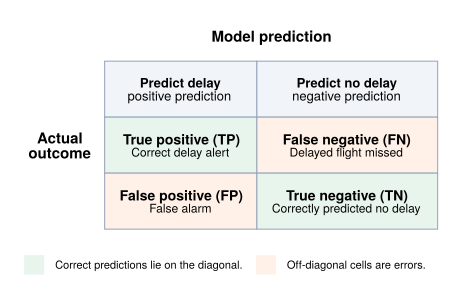

# Appendix F

[Back to the main report](README.md)

This appendix is a reference for the evaluation terms used in this project. For all four models, the **positive class**
is a flight delayed by at least 15 minutes (`DepDel15 = 1` or `ArrDel15 = 1`), and the **negative class** is a flight
that is not delayed by at least 15 minutes. The definitions below therefore describe finding delayed flights, although
the same definitions apply to any binary-classification problem.

## Confusion matrix

A predicted probability becomes a class prediction after a decision threshold is applied. The confusion matrix counts
the four possible combinations of predicted and actual class.

Let $N = TP + TN + FP + FN$. Metrics based on these four counts change when the decision threshold changes.

## Threshold-dependent classification metrics

| Metric | Definition | Interpretation for this project |
|---|---|---|
| **Accuracy** | $\frac{TP + TN}{N}$ | Fraction of all flights classified correctly. Higher is better. Because non-delayed flights are more common, accuracy can be high even when many delayed flights are missed. |
| **Balanced accuracy** | $\frac{1}{2}\left(\frac{TP}{TP+FN} + \frac{TN}{TN+FP}\right)$ | Average of recall for delayed flights and recall for non-delayed flights. Higher is better. It gives the two classes equal weight even when their sizes differ; 0.5 is the no-skill reference for a binary problem. |
| **Precision** | $\frac{TP}{TP+FP}$ | Among flights for which the model issues a delay alert, the fraction that are actually delayed. Higher precision means fewer false alarms. |
| **Recall** | $\frac{TP}{TP+FN}$ | Among flights that are actually delayed, the fraction found by the model. Higher recall means fewer missed delays. Recall is also called **sensitivity** or the **true-positive rate (TPR)**. |
| **F1 score** | $2\frac{\mathrm{Precision}\times\mathrm{Recall}}{\mathrm{Precision}+\mathrm{Recall}}$ | Harmonic mean of precision and recall. Higher is better. F1 is high only when both alert correctness and delayed-flight coverage are high, but it does not use true negatives. |
| **Matthews correlation coefficient (MCC)** | $\frac{TP\times TN-FP\times FN}{\sqrt{(TP+FP)(TP+FN)(TN+FP)(TN+FN)}}$ | Correlation between the predicted and actual binary classes using all four confusion-matrix cells. It is useful with unequal class sizes. MCC ranges from -1 (complete disagreement) through 0 (no correlation) to 1 (perfect agreement). |

**Specificity**, or the **true-negative rate (TNR)**, is $\frac{TN}{TN+FP}$: the fraction of non-delayed flights correctly
identified. Balanced accuracy is the average of sensitivity and specificity.

## Probability ranking and calibration metrics

These metrics use predicted probabilities rather than one set of class predictions, so they do not change when only the
classification threshold changes.

| Metric | Definition | Interpretation for this project |
|---|---|---|
| **ROC AUC** | Area under the receiver operating characteristic curve, which plots recall (TPR) against the false-positive rate, $\frac{FP}{FP+TN}$, over all thresholds. | Probability that a randomly selected delayed flight receives a higher model score than a randomly selected non-delayed flight, with half credit for ties. Higher is better: 0.5 represents random ranking and 1.0 perfect ranking. Because it weights performance on both classes, it can look strong even when precision for the smaller delayed class is modest. |
| **Average precision (AP)** | Weighted mean of precision as recall increases: $AP=\sum_n(R_n-R_{n-1})P_n$, where $P_n$ and $R_n$ are precision and recall at successive thresholds. | Summarizes the precision-recall curve and emphasizes ranking quality for the delayed class. Higher is better. The no-skill reference is the delayed-flight prevalence, so AP should be read relative to the delay rate of the evaluated data. AP is the project's main model-ranking metric. |
| **Brier score** | Mean squared probability error: $\frac{1}{N}\sum_{i=1}^{N}(p_i-y_i)^2$, where $p_i$ is the predicted delay probability and $y_i$ is 1 for a delay and 0 otherwise. | Measures the accuracy of the probabilities, not just their order. Lower is better: 0 is perfect and 1 is the worst possible binary score. It reflects both calibration and the model's ability to separate the classes and should be compared on the same flight population. |

## Related evaluation terms

| Term | Definition |
|---|---|
| **Predicted probability** | The model's estimated probability $p_i$ that a flight belongs to the delayed class. |
| **Decision threshold** | The cutoff used to convert a probability into an alert. A flight is predicted delayed when $p_i$ is at or above the threshold. Lowering the threshold usually increases recall and false alarms; raising it usually increases precision and missed delays. |
| **Prevalence** | Fraction of evaluated flights that are actually delayed: $\frac{TP+FN}{N}$. It is the no-skill reference for average precision and can change across years or flight populations. |
| **Precision-recall curve** | Precision plotted against recall as the decision threshold varies. It shows the tradeoff between finding more delayed flights and keeping alerts correct. AP summarizes this curve. |
| **ROC curve** | TPR plotted against the false-positive rate as the decision threshold varies. ROC AUC summarizes this curve. |
| **Calibration** | Agreement between predicted probabilities and observed frequencies. For example, among flights assigned a delay probability near 0.30, about 30% should be delayed if the model is well calibrated. A calibration (reliability) curve displays this relationship; the Brier score provides a numeric probability-error summary. |

No single metric answers every evaluation question. In this project, AP and ROC AUC describe ranking, Brier score and
the calibration curve describe probability quality, and the confusion-matrix metrics describe behavior at a stated
operating threshold.
