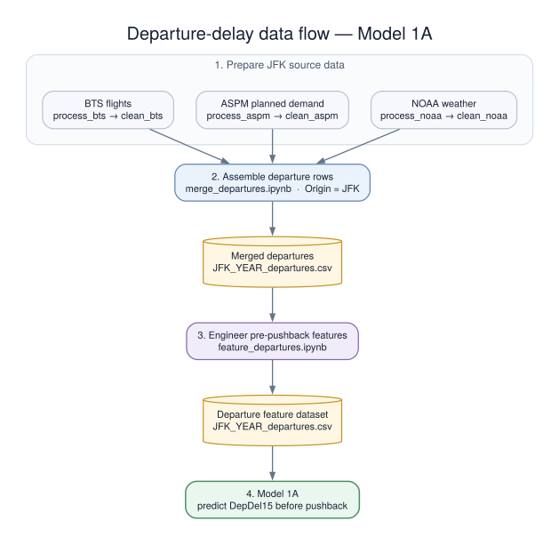
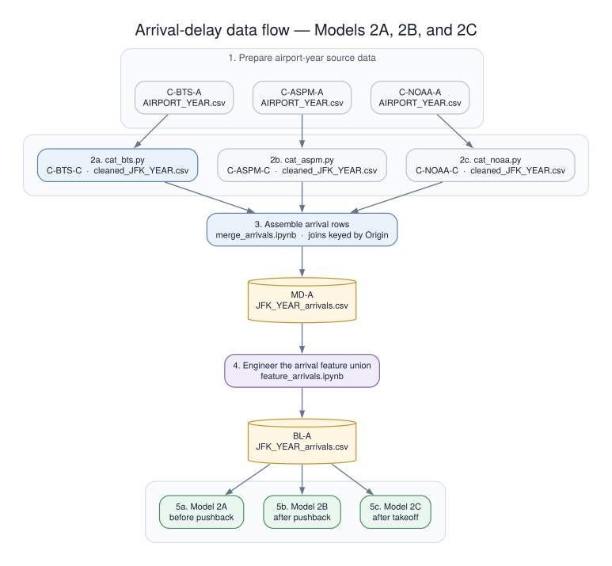

# Capstone Project - Berkeley ML and AI 
## Initial Report and Exploratory Data Analysis

## Table of Contents

- [Overview](#overview)
  - [Predict departure delay](#predict-departure-delay)
  - [Predict arrival delay](#predict-arrival-delay)
- [Business Understanding](#business-understanding)
- [Data Understanding](#data-understanding)
  - [Data Sources](#data-sources)
  - [Data Coverage](#data-coverage)
  - [Why arrival-delay prediction requires more data](#why-arrival-delay-prediction-requires-more-data)
    - [Departure-delay scenario: Model 1A](#departure-delay-scenario-model-1a)
    - [Arrival-delay scenario: Models 2A, 2B, and 2C](#arrival-delay-scenario-models-2a-2b-and-2c)
  - [Data Flow](#data-flow)
    - [Departure-delay data flow: Model 1A](#departure-delay-data-flow-model-1a)
    - [Arrival-delay data flow: Models 2A, 2B, and 2C](#arrival-delay-data-flow-models-2a-2b-and-2c)
  - [Matching Records by Time](#matching-records-by-time)
  - [Model Outcomes and Available Information](#model-outcomes-and-available-information)
  - [EDA](#eda)
    - [List of Figures](#list-of-figures)
- [Data Preparation](#data-preparation)
  - [Data Directory](#data-directory)
  - [BTS](#bts)
  - [ASPM](#aspm)
  - [NOAA](#noaa)
  - [Merged](#merged)
  - [Features](#features)
- [Modeling](#modeling)
  - [Experiment roadmap](#experiment-roadmap)
  - [How experiments are compared](#how-experiments-are-compared)
  - [Arrival prediction comparison](#arrival-prediction-comparison)
- [Evaluation](#evaluation)
- [Deployment](#deployment)
- [References](#references)
  - [Data Sources](#data-sources-1)
  - [Papers](#papers)
- [Appendix A](#appendix-a)
  - [BTS Column Selection and Dictionary](#bts-column-selection-and-dictionary)
    - [Prediction-time eligibility of key BTS operational fields](#prediction-time-eligibility-of-key-bts-operational-fields)
    - [BTS columns retained for modeling](#bts-columns-retained-for-modeling)
    - [Dropped airline, airport, time-block, and operational columns](#dropped-airline-airport-time-block-and-operational-columns)
    - [Dropped diversion summary columns](#dropped-diversion-summary-columns)
    - [Dropped diversion-stop columns](#dropped-diversion-stop-columns)
    - [Dropped export artifact](#dropped-export-artifact)
  - [ASPM Column Selection and Dictionary](#aspm-column-selection-and-dictionary)
    - [ASPM columns retained for modeling](#aspm-columns-retained-for-modeling)
    - [ASPM columns dropped during processing](#aspm-columns-dropped-during-processing)
    - [ASPM names after merge](#aspm-names-after-merge)
  - [NOAA Column Selection and Dictionary](#noaa-column-selection-and-dictionary)
    - [NOAA columns retained for modeling](#noaa-columns-retained-for-modeling)
    - [NOAA fields dropped during processing](#noaa-fields-dropped-during-processing)
    - [NOAA names after merge](#noaa-names-after-merge)
- [Appendix B](#appendix-b)
  - [Joined Data Column Dictionary](#joined-data-column-dictionary)
    - [Joined BTS flight columns](#joined-bts-flight-columns)
    - [Joined ASPM planned-demand columns](#joined-aspm-planned-demand-columns)
    - [Joined NOAA weather columns](#joined-noaa-weather-columns)
  - [Feature Engineering](#feature-engineering)
    - [Engineered feature dictionary](#engineered-feature-dictionary)
    - [Feature selection and timing rules](#feature-selection-and-timing-rules)
- [Appendix C](#appendix-c)
  - [Experiment protocol](#experiment-protocol)
  - [Primary binary-classification experiments](#primary-binary-classification-experiments)
  - [Reference-model coverage and scope decisions](#reference-model-coverage-and-scope-decisions)
- [Appendix D](#appendix-d)
  - [Results recording rules](#results-recording-rules)
  - [Experiment configurations](#experiment-configurations)
  - [Ranking and calibration results](#ranking-and-calibration-results)
  - [Operating-threshold results](#operating-threshold-results)
    - [Current Model 1A logistic-regression comparison](#current-model-1a-logistic-regression-comparison)
- [Appendix E](#appendix-e)

## Overview

This capstone project investigates whether machine learning can predict significant delays for individual domestic flights
departing from or arriving at John F. Kennedy International Airport (JFK).

A significant delay is defined as a departure or arrival delay of 15 minutes or more. The project also explores 
which flight, airport, and weather conditions are most closely associated with delays.

The project combines three main data sources:

- Bureau of Transportation Statistics (BTS) [flight schedules and performance data](https://www.transtats.bts.gov/DL_SelectFields.aspx?gnoyr_VQ=FGJ&QO_fu146_anzr=b0-gvzr)
- Aviation System Performance Metrics (ASPM) [airport traffic and congestion data](https://www.aspm.faa.gov/apm/sys/main.asp)
- National Oceanic and Atmospheric Administration (NOAA) [weather observations](https://www.ncei.noaa.gov/data/local-climatological-data/access/)

The analysis is organized into two model categories.

### Predict departure delay

1. **Model 1A:** For a flight departing from JFK, predict before pushback whether the flight departs at least 15 minutes late.

### Predict arrival delay

1. **Model 2A:** For a flight arriving at JFK, predict before pushback at the flight origin whether it arrives at least 15 minutes late.
2. **Model 2B:** For a flight arriving at JFK, predict immediately after pushback at the flight origin whether it arrives at least 15 minutes late, using the actual departure delay.
3. **Model 2C:** For a flight arriving at JFK, predict immediately after takeoff at the flight origin whether it arrives at least 15 minutes late, using the actual departure, taxi-out, and takeoff information.

The arrival-delay category applies the same basic flight-level classification approach as the departure-delay category:
combine schedule, route, planned airport demand, and weather information to predict whether an individual
flight crosses the 15-minute delay threshold. 

Models 2A, 2B, and 2C update the arrival-delay prediction as the flight progresses through its operational timeline. 
Model 2A makes an initial prediction using information available before pushback. Model 2B revises that prediction after the flight departs, 
using the actual departure time and delay. Model 2C updates it once more using observed taxi-out and takeoff information. 
Together, the three models show how arrival-delay predictions can become more informed and potentially more accurate as 
actual operating information replaces earlier assumptions.

Arrival-delay modeling has substantially larger and more complex data requirements. Model 1A uses flights departing from JFK and can use JFK ASPM and NOAA data. Models 2A, 2B, and 2C use flights arriving at JFK from many different origin
airports. A complete implementation therefore requires appropriate ASPM and NOAA coverage for those origins, NOAA
station mapping, source-specific cleaning and validation, and joins for every inbound flight.

Each model follows a clear prediction timeline, and a field is included only if it would be known at that time. Information
recorded later is excluded even when it appears in the historical datasets. This prevents the model from learning from
the future, often called data leakage. BTS provides the historical event values used for this analysis. A working
operational model would need equivalent gate-out and takeoff information from a suitable live source. Some 
BTS columns represent events—such as gate departure and takeoff—that an airline or  airport operational system can observe 
when they occur.

## Business Understanding

Flight delays create costs and disruption for passengers, airlines, and airports. Earlier warning of a likely delay 
can help airlines communicate with passengers, adjust staffing and gate plans, and prepare for possible missed connections. 
Airports can also use this information to better understand when congestion or weather is likely to affect operations.

The departure-delay question asks:

- Can a departure delay of 15 minutes or more be identified before pushback?

The arrival-delay questions ask:

- Can an arrival delay of 15 minutes or more be identified before pushback?
- How much does the arrival prediction improve once the actual departure delay is known?
- How much more does the arrival prediction improve once taxi-out and takeoff information is known?

The analysis examines JFK. A useful result does more than produce a
yes-or-no answer. It provides a reliable estimate of delay risk and clearly shows which schedule, airport, and weather
conditions influence the prediction.

The models are intended as decision-support tools, not as proof that a particular factor caused a delay. Success is 
judged by how well the models identify delayed flights, how often their warnings are correct, and whether their results 
can be explained in a useful way.

## Data Understanding

The project brings together flight, airport, and weather data. Each record represents one flight. JFK is the origin for
Model 1A and the destination for Models 2A, 2B, and 2C. Airport and weather records
are added without changing this one-row-per-flight structure.

### Data Sources

| Source | Information used in this project | Level of detail |
|---|---|---|
| Bureau of Transportation Statistics (BTS) | Flight dates and schedules, airline, origin, destination, distance, and departure and arrival outcomes | One row per flight |
| Aviation System Performance Metrics (ASPM) | Scheduled arrivals and departures used as measures of planned airport demand | One row per airport and hour |
| National Oceanic and Atmospheric Administration (NOAA) | Temperature, humidity, visibility, precipitation, wind, and reported weather conditions | One row per weather observation |

BTS provides the individual flight records and the two outcomes the models predict. `DepDel15` identifies flights 
that departed at least 15 minutes late, while `ArrDel15` identifies flights that arrived at least 15 minutes late. ASPM 
describes scheduled airport demand, and NOAA describes the weather observed before departure.

### Data Coverage

The modeling population consists of domestic flights departing from and arriving at JFK in 2019, 2023, and 2024. These years were
selected to represent periods before and after the COVID-19 pandemic when the airport was operating at or near normal
capacity. The 2019 data provides a pre-pandemic baseline, while 2023 and 2024 show flight operations after the major
pandemic-related disruptions had passed.

The 2019 flight data will be used for training, the 2023 data for model development and validation, and the 2024 data for final testing. 
The split preserves time order so that the models are trained on earlier flights and evaluated
on later flights they have not seen.

### Why arrival-delay prediction requires more data

Each flight is represented by one BTS row containing both its `Origin` and `Dest`. The tables below identify the
airport-specific ASPM and NOAA context attached to that row in the two model categories.

#### Departure-delay scenario: Model 1A

| Airport role | BTS information used                                       | ASPM context                                 | NOAA context                                        | Data footprint                 |
|---|------------------------------------------------------------|----------------------------------------------|-----------------------------------------------------|--------------------------------|
| JFK origin | Schedule, airline, route, distance, and `DepDel15` target  | JFK planned traffic near scheduled departure | Latest JFK weather available by the prediction time | BTS, ASPM, NOAA for JFK Origin |
| Flight destination | Destination and schedule information from the same BTS row | -                                            | -                                                   | -                              |

#### Arrival-delay scenario: Models 2A, 2B, and 2C

| Airport role | BTS information used | ASPM context                                   | NOAA context                                                   | Data footprint                         |
|---|---|------------------------------------------------|----------------------------------------------------------------|----------------------------------------|
| Each flight origin | Schedule, airline, route, and Model 2B/2C operating fields | Planned traffic near departure for that origin | Latest origin weather available by the model's prediction time | BTS, ASPM, NOAA for 54 origin airports |
| JFK destination | Destination identity, scheduled arrival information, and `ArrDel15` target from the same BTS row | -                                              | -                                                              | BTS for JFK Destination                |

Both scenarios use the same basic idea: combine flight-level BTS information with planned airport demand and
weather to classify whether a flight crosses the 15-minute delay threshold. The difference is the scale of the external
data work. Model 1A always departs from JFK, so one ASPM dataset and one NOAA station can serve every row. In the
arrival scenario, the departure airport changes from flight to flight. Each included origin needs ASPM coverage, a NOAA
station mapping, source cleaning and validation, and its own prediction-time-safe joins.

Models 2B and 2C also introduce later BTS operating events, but those fields do not create the main data expansion. The
larger burden comes from collecting and validating consistent ASPM and NOAA context across the inbound flights.
Destination ASPM and weather are not part of the baseline arrival design. With the arrival scenario, weather observed at landing is
prohibited because it was not available when the prediction was made.

The work includes:

- Checking data quality, missing values, unusual values, and the balance between delayed and on-time flights
- Exploring which flight, airport, and weather conditions are most closely associated with delays
- Creating useful features from dates, times, flights, airport, and weather conditions
- Comparing logistic regression, random forest, and gradient-boosting models such as CatBoost
- Measuring model performance on later flights that were not used for training
- Explaining which factors have the strongest effect on each model's predictions

The project focuses on individual flights. Aircraft rotations, previous-flight chains, and delay spread through an airline 
network are out of scope. The approach is informed by the flight-level delay research of Snell, Zoutendijk, and Pineda. 
The final analysis focuses on model performance and the factors associated with delays at JFK.

### Data Flow

The two scenarios use the same basic processing and cleaning steps, but they prepare different groups of flights and
airport conditions. The departure path needs data for JFK only. The arrival path first gathers flights bound for JFK
and then gathers conditions at each flight's origin. In the diagrams below, `YEAR` represents 2019, 2023, or 2024.

#### Departure-delay data flow: Model 1A



For each year, the cleaned BTS, ASPM, and NOAA files provide flight, planned airport traffic, and weather data for JFK.
The departure merge keeps flights whose `Origin` is `JFK`, with one row for each eligible flight. It adds JFK's scheduled
arrivals and departures for the hour before, the hour containing, and the hour after the scheduled departure. It also
adds the latest JFK weather report available by scheduled departure, provided that the report is no more than 90 minutes
old.

`feature_departures.ipynb` then adds fixed, calculated features that would be available before pushback. The saved table
also keeps the `DepDel15` target and columns needed for checking the data. When Model 1A is trained, the approved input
list in `notebooks/feature_engineering.py` selects only the permitted predictors. Steps that learn from data—including
filling missing values, encoding categories, scaling, selecting features, balancing classes, and choosing a decision
threshold—are fitted on training data only.

#### Arrival-delay data flow: Models 2A, 2B, and 2C



The arrival path covers flights to JFK from the working group of 54 origin airports. `data/bts/cat_bts.py` combines the
cleaned airport files, keeps flights whose `Dest` is `JFK`, standardizes flight numbers, and removes duplicate copies of
the same flight. The resulting flight table identifies which origins are needed. The ASPM and NOAA scripts then combine
the cleaned traffic and weather files for those origins. This is the main reason the arrival preparation is larger than
the departure preparation.

For each JFK-bound flight, `merge_arrivals.ipynb` looks up planned traffic and weather at that flight's `Origin`. It adds
the origin's planned traffic for the previous, current, and next hours, together with the latest origin weather report
available by scheduled departure and no more than 90 minutes old. The merged file keeps the airport codes, source times,
and time differences needed to check each match. The current design does not add JFK destination traffic or weather
data.

`feature_arrivals.ipynb` creates one feature table that supports all three arrival prediction times. Model 2A uses only
information available before pushback. Model 2B adds the actual gate-departure time and departure delay. Model 2C also
adds taxi-out and takeoff information. Separate approved input lists in `notebooks/feature_engineering.py` make sure that
information from a later stage of the flight cannot be used for an earlier prediction.

See [Appendix B: Feature Engineering](#feature-engineering) for the candidate features, their construction, and their rationale.

### Matching Records by Time

The scheduled departure date and time, stored in `DATE`, provides the main time for each BTS flight. Each flight is matched
with ASPM schedule records for the previous, current, and next clock hours. The next-hour values are planned counts known
ahead of time, not future operating results. Each flight is also matched with the most recent NOAA observation available
before its scheduled departure. The merge notebook keeps source timestamps and timing differences so the matches can be checked.

This time-based matching prevents a model from using airport conditions or weather observations that occurred after the prediction was made. It also allows the age of the matched information to be checked before modeling.

### Model Outcomes and Available Information

| Category  | Model | Outcome | Information available when the prediction is made |
|-----------|---|---|---|
| Departure | Model 1A | `DepDel15` | Flight schedule, earlier airport conditions, and earlier weather observations |
| Arrival   | Model 2A | `ArrDel15` | The same general pre-pushback information as Model 1A, collected for the flight origin |
| Arrival   | Model 2B | `ArrDel15` | Model 2A information plus the actual departure time and departure delay |
| Arrival   | Model 2C | `ArrDel15` | Model 2B information plus taxi-out and takeoff information |

The shared feature files include measures of time of day, season, route, distance, planned traffic, and weather. Each
model notebook uses only the fields allowed at its prediction time, so information recorded later in the flight is left
out of that model.

### EDA

The exploratory data analysis notebooks examine data quality, target balance, temporal and route-related delay patterns,
weather, planned airport traffic, and differences across the available datasets. The figures are organized below by
their source notebook.

#### List of Figures

| Figure | Visualization | Description |
|---:|---|---|
| 1 | [Missing values](eda/01_data_quality_and_targets.ipynb#missing-values) | Counts and percentages of missing values by column. |
| 2 | [Delay target balance](eda/01_data_quality_and_targets.ipynb#target-balance) | Class balance for the departure- and arrival-delay targets. |
| 3 | [Daily flight volume](eda/01_data_quality_and_targets.ipynb#flight-volume-over-the-year) | Number of scheduled JFK departures on each date. |
| 4 | [Timing of matched source records](eda/01_data_quality_and_targets.ipynb#timing-of-matched-source-records) | ASPM time offsets and the age of matched NOAA observations. |
| 5 | [Monthly delay rate](eda/02_delay_patterns.ipynb#delay-rate-by-month) | Departure- and arrival-delay rates by calendar month. |
| 6 | [Delay rate by day of week](eda/02_delay_patterns.ipynb#delay-rate-by-day-of-week) | Delay rates from Monday through Sunday. |
| 7 | [Delay rate by scheduled departure hour](eda/02_delay_patterns.ipynb#delay-rate-by-scheduled-departure-hour) | Hourly pattern of delay risk across the operating day. |
| 8 | [Delay rate by time of day](eda/02_delay_patterns.ipynb#broad-time-of-day-comparison) | Delay rates for broad overnight, morning, afternoon, and evening periods. |
| 9 | [Delay rate for the busiest airlines](eda/02_delay_patterns.ipynb#airlines) | Delay rates for the airlines operating the most JFK departures. |
| 10 | [Delay rate for the busiest destinations](eda/02_delay_patterns.ipynb#destinations) | Delay rates for the most frequently served destinations. |
| 11 | [Delay rate by BTS distance group](eda/02_delay_patterns.ipynb#distance-group) | Delay rates across BTS route-distance bands. |
| 12 | [Departure-delay rate by airline and weekday](eda/02_delay_patterns.ipynb#airline-and-weekday-interaction) | Airline-by-weekday heatmap of departure-delay rates. |
| 13 | [Departure-delay rate by month and scheduled hour](eda/02_delay_patterns.ipynb#month-and-scheduled-hour-interaction) | Month-by-hour heatmap showing seasonal changes in daily delay patterns. |
| 14 | [Departure and arrival delay outcomes](eda/02_delay_patterns.ipynb#relationship-between-departure-and-arrival-outcomes) | Joint distribution of departure and arrival delay classifications. |
| 15 | [Departure-delay distributions](eda/02_delay_patterns.ipynb#departure-delay-duration) | Signed departure delays and nonnegative delay durations. |
| 16 | [Weather distributions](eda/03_weather_and_congestion.ipynb#weather-distributions) | Distributions of temperature, humidity, visibility, precipitation, and wind. |
| 17 | [Delay rate by reported weather](eda/03_weather_and_congestion.ipynb#adverse-weather-comparison) | Delay rates with and without reported adverse weather. |
| 18 | [Delay rate during reported weather conditions](eda/03_weather_and_congestion.ipynb#individual-weather-conditions) | Delay rates associated with individual reported weather conditions. |
| 19 | [Delay rate by visibility](eda/03_weather_and_congestion.ipynb#visibility) | Delay rates across operationally interpretable visibility categories. |
| 20 | [Scheduled airport traffic around departure](eda/03_weather_and_congestion.ipynb#scheduled-airport-traffic) | Planned traffic distributions for the previous, current, and next hours. |
| 21 | [Delay rate by three-hour scheduled traffic](eda/03_weather_and_congestion.ipynb#delay-rate-by-traffic-level) | Delay rates across quintiles of three-hour planned traffic. |
| 22 | [Departure-delay rate across current-hour scheduled demand](eda/03_weather_and_congestion.ipynb#current-hour-arrivals-and-departures) | Delay risk across combinations of scheduled departures and arrivals. |
| 23 | [Departure delay by weather and traffic](eda/03_weather_and_congestion.ipynb#weather-and-congestion-together) | Interaction between adverse weather and planned traffic level. |
| 24 | [Selected numeric correlations](eda/03_weather_and_congestion.ipynb#correlation-overview) | Correlations among targets, weather, traffic, and source-age fields. |
| 25 | [JFK flights by year](eda/04_airport_year_comparison.ipynb#dataset-size-and-basic-coverage) | Flight counts for the 2019, 2023, and 2024 JFK datasets. |
| 26 | [JFK delay rates by year](eda/04_airport_year_comparison.ipynb#departure-and-arrival-delay-rates) | Departure- and arrival-delay class balance across years. |
| 27 | [JFK delay-rate heatmap](eda/04_airport_year_comparison.ipynb#delay-rate-heatmaps) | Compact comparison of departure and arrival delay rates by year. |
| 28 | [Monthly JFK delay rates by year](eda/04_airport_year_comparison.ipynb#monthly-patterns) | Seasonal delay patterns compared across the three study years. |
| 29 | [Hourly JFK delay rates by year](eda/04_airport_year_comparison.ipynb#scheduled-hour-patterns) | Daily delay build-up compared across the three study years. |
| 30 | [JFK scheduled traffic around departure by year](eda/04_airport_year_comparison.ipynb#airport-traffic-distributions) | Planned previous-, current-, and next-hour traffic across years. |
| 31 | [JFK weather and source timing by year](eda/04_airport_year_comparison.ipynb#weather-and-source-timing-differences) | Visibility, ASPM offsets, and NOAA observation age across years. |

## Data Preparation

### Data Directory

```text
data/
├── bts/
│   ├── L_UNIQUE_CARRIERS.csv
│   ├── raw/
│   │   └── YEAR/
│   │       ├── On_Time_Reporting_Carrier_On_Time_Performance_(1987_present)_YEAR_1.csv
│   │       ├── ... monthly CSVs through YEAR_12.csv
│   │       ├── YEAR_csv_files.zip
│   │       └── JFK.csv
│   ├── processed/
│   │   ├── _csv_files.zip
│   │   └── JFK_YEAR.csv
│   ├── cleaned/
│   │   ├── _csv_files.zip
│   │   └── JFK_YEAR.csv
│   └── cleaned_JFK_YEAR.csv
├── aspm/
│   ├── raw/
│   │   └── aspm_output/
│   │       └── run_YEAR_AIRPORT/
│   │           ├── aspm_YEAR_AIRPORT.csv
│   │           └── raw_html.zip
│   ├── processed/
│   │   ├── _csv_files.zip
│   │   └── JFK_YEAR.csv
│   ├── cleaned/
│   │   ├── _csv_files.zip
│   │   └── JFK_YEAR.csv
│   └── cleaned_JFK_YEAR.csv
├── noaa/
│   ├── raw/
│   │   ├── airport_station_map.csv
│   │   └── YEAR/
│   │       ├── YEAR_csv_files.zip
│   │       └── STATION.csv
│   ├── processed/
│   │   ├── _csv_files.zip
│   │   └── JFK_YEAR.csv
│   ├── cleaned/
│   │   ├── _csv_files.zip
│   │   └── JFK_YEAR.csv
│   └── cleaned_JFK_YEAR.csv
├── merged/
│   ├── JFK_YEAR_departures.csv
│   └── JFK_YEAR_arrivals.csv
└── features/
    ├── JFK_YEAR_departures.csv
    └── JFK_YEAR_arrivals.csv
```

`YEAR` stands for 2019, 2023, or 2024. `AIRPORT` is an airport included in the project, and `STATION` is the NOAA weather
station matched to that airport. Within each source directory, `cleaned/` holds one cleaned CSV for each airport and
year. The `cleaned_JFK_YEAR.csv` files combine the airport data needed for flights arriving at JFK, giving the arrival
merge one consolidated input from each source.

This layout makes it possible to follow the data from the original sources to the final model-ready features. Along the
way, the preparation steps check that every merged or feature row still represents one eligible flight and that a model
uses only information that would have been available when its prediction is made. Model 1A predicts departure delay for
flights leaving JFK. Models 2A, 2B, and 2C predict arrival delay for flights headed to JFK, using conditions at the
flight's origin and adding operating information as it becomes available.

### BTS

The `data/bts/` directory provides the flight records and delay targets for both scenarios. Each cleaned row represents
one completed domestic flight. BTS On-Time Performance data is downloaded as monthly files covering flights reported by
the included United States airlines. For each airport and year, these raw files are filtered into one annual
`AIRPORT.csv` containing flights that either depart from or arrive at that airport.

`process_bts.ipynb` keeps the schedule, airline, route, distance, operating-event, and outcome fields needed for the
project. It removes cancelled and diverted flights because their delay outcomes cannot be compared fairly with those of
completed flights. It then writes `data/bts/processed/AIRPORT_YEAR.csv`. `clean_bts.ipynb` standardizes and checks dates,
clock fields, airport and carrier codes, duplicate-flight keys, numeric ranges, and delay labels. It also creates `DATE`,
the scheduled-departure timestamp used by both merge paths, and writes the cleaned airport file to
`data/bts/cleaned/AIRPORT_YEAR.csv`.

The two scenarios use these cleaned records differently:

- **Departure scenario:** `data/bts/cleaned/JFK_YEAR.csv` provides flights with `JFK` as their `Origin`. `DepDel15` is the
  target for Model 1A.
- **Arrival scenario:** `data/bts/cat_bts.py` combines the cleaned airport-year files, keeps flights with `JFK` as their
  `Dest`, standardizes flight numbers, removes duplicate rows created by overlapping files, and writes
  `data/bts/cleaned_JFK_YEAR.csv`. `ArrDel15` is the target shared by Models 2A, 2B, and 2C. The BTS row also keeps the
  pushback and takeoff fields that Models 2B and 2C may use at their later prediction times.

### ASPM

The `data/aspm/` directory provides the planned number of arrivals and departures at each airport, rather than results
for individual flights. Each cleaned row represents one airport and one clock hour. The raw data contains one annual
hourly file for each airport. `process_aspm.ipynb` removes supporting calculation fields and actual performance measures
that are published too late for the project's prediction times. It keeps the airport and time identifiers together with
the scheduled hourly departure and arrival counts, then writes `data/aspm/processed/AIRPORT_YEAR.csv`.

`clean_aspm.ipynb` checks airport-hour keys, numeric values, duplicate records, row order, and hourly coverage. It fills
in missing clock hours where needed and creates an hourly `DATE` timestamp before writing
`data/aspm/cleaned/AIRPORT_YEAR.csv`. The scheduled counts are plans known before departure. Actual ASPM delay and
on-time measures are not used as predictors.

- **Departure scenario:** the merge uses the cleaned JFK file because every Model 1A flight leaves from JFK.
- **Arrival scenario:** `data/aspm/cat_aspm.py` finds the required origin airports in the table of JFK-bound flights and
  combines their cleaned airport-year files into `data/aspm/cleaned_JFK_YEAR.csv`. Each flight is matched to planned
  demand at its origin, not at its JFK destination.

### NOAA

The `data/noaa/` directory provides weather observations from the airport where each flight departs. Each cleaned row is
one selected weather report for an airport and time. Raw Local Climatological Data is stored in one annual CSV for each
weather station. `airport_station_map.csv` links every project airport to its NOAA station so the same airport code can
be used across the data sources.

`process_noaa.ipynb` keeps the useful weather measurements, removes reports with no usable observations, and writes
`data/noaa/processed/AIRPORT_YEAR.csv`. `clean_noaa.ipynb` selects one preferred report for each timestamp, converts trace
precipitation to a small numeric value, turns reported-weather text into condition indicators, and converts wind
direction and speed into `WindX` and `WindY`. A missing continuous measurement may be filled from an earlier report only
when that report is no more than 90 minutes old. Missing values at the beginning of a file and across longer gaps are
left for the model's training pipeline to handle. The cleaned file is written to
`data/noaa/cleaned/AIRPORT_YEAR.csv`.

- **Departure scenario:** the cleaned JFK station-year file provides weather observed at JFK before scheduled departure.
- **Arrival scenario:** `data/noaa/cat_noaa.py` combines the cleaned station data for the origin airports found in the
  JFK-bound BTS table and writes `data/noaa/cleaned_JFK_YEAR.csv`. Each flight receives weather from its origin.
  Destination weather and weather observed near landing are not part of the baseline design.

### Merged

The `data/merged/` directory contains one row for each eligible flight after the flight, planned-demand, and weather data
have been brought together. The merge notebooks keep source airport codes, timestamps, and time differences so that the
airport matches and prediction timing can be checked. If a source record cannot be matched, the notebooks report it
instead of silently removing the flight.

- **Departure scenario:** `merge_departures.ipynb` keeps flights with `Origin == JFK`. It joins JFK ASPM records for the
  previous, current, and next clock hours around scheduled departure and adds the latest JFK NOAA report available at or
  before scheduled departure, as long as it is no more than 90 minutes old. It writes
  `data/merged/JFK_YEAR_departures.csv`.
- **Arrival scenario:** `merge_arrivals.ipynb` keeps flights with `Dest == JFK` and matches the other sources using each
  flight's `Origin`. It adds the origin's three ASPM periods and latest NOAA report available by scheduled departure, as
  long as the report is no more than 90 minutes old. It then writes `data/merged/JFK_YEAR_arrivals.csv`. ASPM and NOAA
  data for the JFK destination are not added.

The next-hour ASPM values in both files are planned schedule counts known in advance, not future operating results. The
merged files keep source and outcome columns for checking the data, but this does not mean that every retained column may
be used as a model predictor.

### Features

The `data/features/` directory contains the feature files used by the modeling notebooks. Each row still represents the
same flight as the matching row in the merged file. This step creates features using fixed formulas only. It does not
fit or choose imputers, encoders, scalers, feature selectors, resampling methods, or decision thresholds. Those steps
belong to modeling rather than shared feature creation.

- **Departure scenario:** `feature_departures.ipynb` adds the shared features available before pushback and writes
  `data/features/JFK_YEAR_departures.csv` for Model 1A.
- **Arrival scenario:** `feature_arrivals.ipynb` writes `data/features/JFK_YEAR_arrivals.csv`. This file contains all
  features needed across the three arrival prediction times. Model 2A uses only schedule and origin information
  available before pushback. Model 2B adds the actual gate-departure time and departure-delay information. Model 2C also
  allows taxi-out and wheels-off information.

These shared files intentionally contain more columns than any one model may use. Each model notebook uses the allowlist
for its prediction time—the named set of columns permitted at that point—from `notebooks/feature_engineering.py`. Any
preprocessing that must learn from the data is fitted on the training data only.

[Appendix A](#appendix-a) documents the [BTS](#bts-column-selection-and-dictionary),
[ASPM](#aspm-column-selection-and-dictionary), and [NOAA](#noaa-column-selection-and-dictionary) source-column
decisions. [Appendix B](#appendix-b) documents the
[joined data columns](#joined-data-column-dictionary) and
[feature-engineering analysis](#feature-engineering).

## Modeling

The project uses four models to answer two related questions: whether a flight will leave JFK at least 15 minutes late,
and whether a flight headed to JFK will arrive at least 15 minutes late. The arrival prediction is updated as more
information becomes available during the flight.

| Model | Prediction time | Flights and target | Information available |
|---|---|---|---|
| 1A | Before pushback | JFK departures; predict `DepDel15` | Schedule, route, planned JFK traffic, and JFK weather |
| 2A | Before pushback at the origin | JFK arrivals; predict `ArrDel15` | Schedule, route, planned origin traffic, and origin weather |
| 2B | Immediately after pushback | Same JFK arrivals and target as 2A | Model 2A information plus actual gate-out time and departure delay |
| 2C | Immediately after takeoff | Same JFK arrivals and target as 2A | Model 2B information plus taxi-out time and actual takeoff time |

[Appendix C](#appendix-c) contains the full experiment plan and notebook registry. [Appendix D](#appendix-d) records the
settings and results for completed experiments.

### Experiment roadmap

The core experiment plan has two stages. Both focus on the project's main goal: predicting whether a flight will be at
least 15 minutes late.

| Stage | Main question | Work included |
|---|---|---|
| I | Which approach works best for predicting a JFK departure delay before pushback? | Compare Model 1A feature sets and a broad group of methods: logistic regression, decision trees, K-nearest neighbors (KNN), Naive Bayes, support vector machine (SVM), linear discriminant analysis (LDA), bagging, Random Forest, Extra Trees, boosting, CatBoost, and a neural network. Also compare methods for handling the smaller delayed class and for improving predicted probabilities. |
| II | How much does arrival prediction improve when pushback and takeoff information become available? | Compare logistic regression, decision tree, Random Forest, and CatBoost across Models 2A, 2B, and 2C using the same JFK-arrival flights. A method from Stage I may also be included if it provides a clear benefit. |

Stage I provides a broad but manageable comparison on Model 1A. Stage II then applies the main model families to the
three arrival prediction times. This avoids running every possible method and feature set at every prediction time while
still allowing a strong Stage I method to be carried into the arrival comparison.

The [experiment registry](#primary-binary-classification-experiments) lists the Stage I and II notebooks.

### How experiments are compared

Every experiment follows the same rules so the results can be compared fairly:

1. **Keep the flight populations consistent.** Model 1A uses JFK departures and `DepDel15`. Models 2A, 2B, and 2C use
   the same JFK-arrival flights and `ArrDel15`. Only the information available at each arrival prediction time changes.
2. **Respect time order.** Features and model settings are chosen by moving through complete days of 2019 in time order:
   earlier periods are used for training and later periods for checking the model. The selected modeling process is then
   trained on 2019 and checked on the complete 2023 dataset. The 2024 data is reserved for the final test after the model
   and decision threshold have been chosen.
3. **Prevent future information from entering the model.** Each notebook has a clear list of fields allowed at its
   prediction time. Any step that learns from the data—including filling missing values, converting categories into
   numeric inputs, scaling values, choosing features, balancing the two outcome classes, adjusting probabilities, and
   selecting a decision threshold—uses training data only.
4. **Use measures suited to an uncommon outcome.** Delayed flights are the smaller class, so average precision is the
   main measure used to rank models. ROC AUC provides another view of ranking, and the Brier score checks the quality of
   predicted probabilities. At a chosen cutoff, precision shows how often delay alerts are correct, recall shows how
   many delayed flights are found, and F1 balances those two measures. Ordinary accuracy is supporting information
   because it can look good even when a model misses many delayed flights. Appendix C lists the additional measures.
5. **Choose the decision threshold separately.** Results are reported at the standard 0.50 cutoff and at a cutoff chosen
   from 2019 training-period predictions. The 2023 or 2024 outcomes are not used to choose that cutoff.
6. **Compare like with like.** Modeling methods are compared within the same model and flight population. Models 2A,
   2B, and 2C are compared on identical arrival rows so any difference reflects the newly available flight information
   rather than a change in the sample.

The full rules for repeatability, class balancing, model explanations, and checks across months, airlines, routes,
weather, and traffic levels are in [Appendix C: Experiment protocol](#experiment-protocol).

### Arrival prediction comparison

Models 2A, 2B, and 2C are designed as a controlled comparison. They use the same flights, date ranges, target, and basic
schedule, route, traffic, and weather fields. Model 2B adds information known at pushback, and Model 2C adds information
known at takeoff. This setup measures the value of waiting for actual operating information.

The field rules follow the same timing. `DepTime` and `DepDelay` are not available to Model 2A because pushback has not
occurred. `TaxiOut` and `WheelsOff` are not available to Models 2A or 2B because they are not fully known until takeoff.
This keeps information from later in the flight out of the earlier predictions.

Earlier research suggests that actual departure information can improve arrival-delay prediction, especially once the
departure delay is known. This project tests that result across the same JFK-bound flights. The comparison also captures
a practical tradeoff: a prediction made after takeoff may be more accurate, but it gives airlines and passengers less
time to act.

Arrival prediction may also be harder than departure prediction. Model 1A always describes operations at JFK, while the
arrival models include flights from many origins with different weather, traffic, and airport conditions. Using the same
arrival rows for Models 2A, 2B, and 2C makes that added variation part of every arrival experiment rather than a source
of unfair differences between them.

Completed experiment configurations, model-comparison measures, and decision-threshold results are recorded in
[Appendix D](#appendix-d).

## Evaluation

## Deployment

## References

### Data Sources

1. [BTS - Aviation Data Library](https://www.transtats.bts.gov/databases.asp?Z1qr_VQ=E&Z1qr_Qr5p=N8vn6v10&f7owrp6_VQF=D)
2. [BTS - Airline On-Time Performance Data](https://www.transtats.bts.gov/DL_SelectFields.aspx?gnoyr_VQ=FGJ&QO_fu146_anzr=b0-gvzr)
3. [NOAA - Access](https://www.ncei.noaa.gov/access)
4. [NOAA - Local Climatological Data](https://www.ncei.noaa.gov/data/local-climatological-data/access/)
5. [ASPM - Aviation System Performance Metrics](https://www.aspm.faa.gov/apm/sys/main.asp)

### Papers
1. Kenney Snell, Jozef Zurada, Jan Kozak, and Zahra Hatami, *Predicting Flight Delays Using Machine Learning*. **Primary reference.**
2. Micha Zoutendijk and Mihaela Mitici, *Probabilistic Flight Delay Predictions Using Machine Learning and Applications to the Flight-to-Gate Assignment Problem*. **Primary reference.**
3. Juan Pineda-Jaramillo, Claudia Munoz, Rodrigo Mesa-Arango, Carlos Gonzalez-Calderon, and Anne Lange, *Integrating Multiple Data Sources for Improved Flight Delay Prediction Using Explainable Machine Learning*. **Primary reference.**
4. Meng Li, *Air Traffic Delay Prediction Based on Machine Learning and Delay Propagation*.
5. Jun Chen and Meng Li, *Chained Predictions of Flight Delay Using Machine Learning*.
6. Maarten Beltman, Marta Ribeiro, Jasper de Wilde, and Junzi Sun, *Dynamically Forecasting Airline Departure Delay Probability Distributions for Individual Flights Using Supervised Learning*.
7. Sarah Ahmed A. AlBassam, *Flight Delay Prediction: Evaluating Machine Learning Algorithms for Enhanced Accuracy*.

# Appendix A

This appendix explains which BTS, ASPM, and NOAA columns are kept, which are removed, and when each retained field is
available to the four models. It describes the cleaned source files that feed the departure and arrival merges.

## BTS Column Selection and Dictionary

The downloaded BTS data contains 110 columns. Processing removes cancelled and diverted flights and drops 83 columns
that are not needed. Cleaning checks the remaining fields and adds `DATE`, producing 28 columns before the ASPM and NOAA
data are joined.

A field must be both useful and available at the time a prediction is made. Some BTS fields describe events that happen
later in the flight. Using one of those fields too early would give the model information from the future, often called
time or target leakage.

BTS is a historical reporting source, but some of its columns describe events—such as pushback and takeoff—that an
airline or airport system could observe when they happen. `DepTime`, `TaxiOut`, and `WheelsOff` are therefore kept, but
their use depends on the model's prediction time. `DepTime` becomes available to Model 2B after pushback. `TaxiOut` is
not complete, and `WheelsOff` is not known, until takeoff, so they become available only to Model 2C.

`clean_bts.ipynb` writes one 28-column file for each airport and year under `data/bts/cleaned/`. For the arrival
scenario, `data/bts/cat_bts.py` combines the required origin-airport files into `data/bts/cleaned_JFK_YEAR.csv` without
changing the column layout.

### Prediction-time eligibility of key BTS operational fields

| Field | Model 1A: before pushback | Model 2A: before pushback | Model 2B: after pushback | Model 2C: after takeoff |
|---|---|---|---|---|
| Scheduled fields such as `CRSDepTime`, `CRSArrTime`, and `CRSElapsedTime` | Eligible | Eligible | Eligible | Eligible |
| `DepTime` and departure-delay fields derived from gate-out | Excluded: not yet known | Excluded: not yet known | Eligible: gate-out has occurred | Eligible |
| `DepDel15` | Target only | Excluded: not yet known | Eligible: gate-out has occurred | Eligible |
| `TaxiOut` and `WheelsOff` | Excluded: takeoff has not occurred | Excluded: takeoff has not occurred | Excluded: takeoff has not occurred | Eligible |
| `ArrDel15` | Not used | Target only | Target only | Target only |
| Other arrival outcomes and post-arrival fields | Excluded | Excluded | Excluded | Excluded |

“Dropped” means that a field is not needed or is not appropriate for this project. It may still be useful in other
aviation studies.

### BTS columns retained for modeling

| Column | Meaning | Why it is retained / how it is used |
|---|---|---|
| `Year` | Calendar year of the flight. | Retained for coverage checks and comparison across 2019, 2023, and 2024. |
| `Quarter` | Calendar quarter, numbered 1 through 4. | Retained as a calendar field; it may later be redundant with month-based features. |
| `Month` | Calendar month, numbered 1 through 12. | Retained for seasonal analysis and feature engineering. |
| `DayofMonth` | Day of the month. | Retained for calendar validation and possible calendar features. |
| `DayOfWeek` | Day of week, where BTS uses 1 for Monday through 7 for Sunday. | Retained for weekly-pattern analysis and feature engineering. |
| `FlightDate` | Scheduled flight date without a time component. | Converted to a pandas datetime and retained as the base calendar date. |
| `Reporting_Airline` | BTS reporting carrier code. | Retained as the main airline identifier. |
| `Tail_Number` | Aircraft registration or tail number. | Retained for audit and validation. It is not intended as a model feature because aircraft-chain and propagation modeling are out of scope. |
| `Flight_Number_Reporting_Airline` | Flight number assigned by the reporting carrier. | Retained as a flight identifier and possible categorical feature; it is not treated as a continuous quantity. |
| `Origin` | Three-letter origin airport code. | Retained to identify flights originating at JFK for Model 1A and the departure airport for Models 2A, 2B, and 2C. |
| `OriginState` | Two-letter state code for the origin airport. | Retained as a compact geographic field. |
| `Dest` | Three-letter destination airport code. | Retained to identify flights arriving at JFK for Models 2A, 2B, and 2C. |
| `DestState` | Two-letter state code for the destination airport. | Retained as a compact geographic field. |
| `CRSDepTime` | Computer Reservation System scheduled departure time in local HHMM form. | Retained because it is known before departure and is used to construct the exact scheduled departure timestamp. |
| `DepTime` | Actual gate departure time in local HHMM form. | Retained as the event-time field for Model 2B and for descriptive analysis. It is excluded from Models 1A and 2A because gate-out has not occurred when those predictions are made. BTS supplies the historical value; a deployed Model 2B would require an operational gate-out feed. |
| `DepDelay` | Actual gate departure time minus scheduled departure time, in minutes; negative values indicate an early departure. | Retained as a Model 2B predictor because it is known once gate-out occurs. It is excluded from Models 1A and 2A. Because it overlaps the other departure-delay fields, the Model 2B feature list should avoid unnecessary duplicate versions of the same information. |
| `DepDelayMinutes` | Nonnegative departure delay in minutes; early departures are recorded as zero. | Retained as a possible Model 2B representation and to validate `DepDelay` and `DepDel15`. It is excluded from pre-pushback predictors and need not be included together with every related departure-delay field. |
| `DepDel15` | Indicator equal to 1 when departure delay is at least 15 minutes. | Target for Model 1A. It is excluded from Model 2A but may be used as a compact post-pushback input for Model 2B because the departure outcome is known at gate-out. It is never used to predict itself in Model 1A. |
| `DepartureDelayGroups` | Departure delay grouped into ordered 15-minute ranges. | Retained for validation, EDA, and possible Model 2B use. It is excluded before pushback and is not automatically included alongside the continuous and binary departure-delay fields. |
| `TaxiOut` | Minutes from gate departure to wheels-off. | Retained as a Model 2C predictor and for validation and EDA. It is excluded from Models 1A, 2A, and 2B because the full taxi-out duration is unknown immediately after pushback. |
| `WheelsOff` | Actual takeoff time in local HHMM form. | Retained as a Model 2C predictor and for validation and EDA. It is excluded from Models 1A, 2A, and 2B because takeoff occurs after their prediction times. As with `DepTime`, BTS is the historical source rather than the proposed live event feed. |
| `CRSArrTime` | Scheduled arrival time in the destination's local HHMM form. | Retained because it is known from the schedule before departure. |
| `ArrDel15` | Indicator equal to 1 when arrival delay is at least 15 minutes. | Target for Models 2A, 2B, and 2C. It is never used as a predictor because it is known only after arrival. |
| `ArrivalDelayGroups` | Arrival delay grouped into ordered 15-minute ranges. | Retained for target validation and EDA. It is excluded from every model input because it describes the completed arrival outcome. |
| `CRSElapsedTime` | Scheduled gate-to-gate elapsed time, in minutes. | Retained as a schedule and route characteristic known before departure. |
| `Distance` | Published distance between origin and destination, in miles. | Retained as a route characteristic. |
| `DistanceGroup` | BTS distance band based on 250-mile intervals. | Retained for grouped analysis and possible categorical modeling. |
| `DATE` | Constructed scheduled departure timestamp created from FlightDate and CRSDepTime. | Added during cleaning. It supports sorting, time-based ASPM and NOAA matching, chronological splitting, and time feature engineering. |

### Dropped airline, airport, time-block, and operational columns

| Column | Meaning | Why it is dropped |
|---|---|---|
| `DOT_ID_Reporting_Airline` | Permanent numeric identifier assigned by the U.S. Department of Transportation to the reporting carrier. | Dropped because Reporting_Airline already supplies the carrier identity in a more readable form. |
| `IATA_CODE_Reporting_Airline` | IATA code for the reporting carrier. | Dropped because it duplicates the retained Reporting_Airline code. |
| `OriginAirportID` | BTS numeric identifier for the origin airport. | Dropped because the retained Origin code uniquely and more readably identifies the airport for this project. |
| `OriginAirportSeqID` | Sequence identifier for a specific historical version of the origin airport record. | Dropped because historical airport-record versioning is not needed and Origin is retained. |
| `OriginCityMarketID` | BTS identifier for the origin city market, which may include multiple airports. | Dropped because the project analyzes named airports and retains Origin. |
| `OriginCityName` | Origin city and state name. | Dropped because Origin and OriginState retain the required location information with less redundancy. |
| `OriginStateFips` | Numeric FIPS code for the origin state. | Dropped because OriginState provides the needed state identifier. |
| `OriginStateName` | Full name of the origin state. | Dropped because it duplicates OriginState. |
| `OriginWac` | World Area Code for the origin. | Dropped because this domestic-airport project does not require the broader geographic code. |
| `DestAirportID` | BTS numeric identifier for the destination airport. | Dropped because the retained Dest code uniquely and more readably identifies the airport for this project. |
| `DestAirportSeqID` | Sequence identifier for a specific historical version of the destination airport record. | Dropped because historical airport-record versioning is not needed and Dest is retained. |
| `DestCityMarketID` | BTS identifier for the destination city market, which may include multiple airports. | Dropped because the project analyzes named airports and retains Dest. |
| `DestCityName` | Destination city and state name. | Dropped because Dest and DestState retain the required location information with less redundancy. |
| `DestStateFips` | Numeric FIPS code for the destination state. | Dropped because DestState provides the needed state identifier. |
| `DestStateName` | Full name of the destination state. | Dropped because it duplicates DestState. |
| `DestWac` | World Area Code for the destination. | Dropped because this domestic-airport project does not require the broader geographic code. |
| `DepTimeBlk` | BTS scheduled departure time block. | Dropped because more precise time-of-day features can be derived from CRSDepTime and DATE. |
| `WheelsOn` | Actual landing time in local HHMM form. | Dropped because it occurs after takeoff and would leak future information into arrival-delay prediction. |
| `TaxiIn` | Minutes from wheels-on to gate arrival. | Dropped because it is known only after landing and would leak the arrival outcome. |
| `ArrTime` | Actual gate arrival time in local HHMM form. | Dropped because it directly reveals the arrival outcome. |
| `ArrDelay` | Actual arrival time minus scheduled arrival time, in minutes. | Dropped because the project uses the binary ArrDel15 target and the numeric value directly reveals that target. |
| `ArrDelayMinutes` | Nonnegative arrival delay in minutes. | Dropped because it directly determines the binary ArrDel15 target. |
| `ArrTimeBlk` | BTS scheduled arrival time block. | Dropped because the more precise CRSArrTime is retained and can be used to derive time categories. |
| `Cancelled` | Indicator that the flight was cancelled. | Cancelled flights are removed because they have no completed departure or arrival outcome; the now-constant indicator is then dropped. |
| `CancellationCode` | BTS code for the reason a flight was cancelled. | Dropped after cancelled flights are removed; it is not applicable to the remaining completed flights. |
| `Diverted` | Indicator that the flight was diverted. | Diverted flights are removed because their scheduled-destination arrival outcome is not comparable with an ordinary completed flight; the now-constant indicator is then dropped. |
| `ActualElapsedTime` | Actual gate-to-gate elapsed time, in minutes. | Dropped because it is known only after arrival and would leak future operational information. |
| `AirTime` | Minutes between wheels-off and wheels-on. | Dropped because it is known only after landing and is outside all four prediction times. |
| `Flights` | BTS row-count field, normally equal to 1 for each flight record. | Dropped because it is an administrative constant rather than a useful flight characteristic. |
| `CarrierDelay` | Minutes of arrival delay attributed to the air carrier. | Dropped because delay-cause minutes are assigned after the outcome and directly reveal that a delay occurred. |
| `WeatherDelay` | Minutes of arrival delay attributed to weather. | Dropped because delay-cause minutes are assigned after the outcome and would leak future information. |
| `NASDelay` | Minutes of arrival delay attributed to the National Airspace System. | Dropped because delay-cause minutes are assigned after the outcome and would leak future information. |
| `SecurityDelay` | Minutes of arrival delay attributed to security. | Dropped because delay-cause minutes are assigned after the outcome and would leak future information. |
| `LateAircraftDelay` | Minutes of arrival delay attributed to a late-arriving aircraft. | Dropped because it is a post-event cause field and aircraft-delay propagation is outside the project scope. |
| `FirstDepTime` | First gate departure time at the origin airport. | Dropped because it describes an irregular event observed after the scheduled prediction time and is sparsely populated. |
| `TotalAddGTime` | Total time away from the gate for a flight that returns to the gate or is cancelled. | Dropped because it is observed after pushback and is not available at the model prediction times. |
| `LongestAddGTime` | Longest period away from the gate for a flight that returns to the gate or is cancelled. | Dropped because it is observed after pushback and is not available at the model prediction times. |

### Dropped diversion summary columns

| Column | Meaning | Why it is dropped |
|---|---|---|
| `DivAirportLandings` | Number of diversion-airport landings. | Dropped because diverted flights are removed from the modeling population. |
| `DivReachedDest` | Indicator that a diverted flight eventually reached its scheduled destination. | Dropped because diverted flights are removed from the modeling population. |
| `DivActualElapsedTime` | Elapsed time for a diverted flight that eventually reaches its scheduled destination. | Dropped because diverted flights are removed and the value is only known after the flight. |
| `DivArrDelay` | Difference between scheduled and actual arrival time for a diverted flight that reaches its scheduled destination. | Dropped because diverted flights are removed and the value directly describes a post-flight outcome. |
| `DivDistance` | Distance between the scheduled destination and the final diversion airport; zero when the diverted flight reaches its scheduled destination. | Dropped because diverted flights are removed from the modeling population. |

### Dropped diversion-stop columns

BTS can record details for as many as five diversion stops. Because diverted flights are removed before modeling, every stop-level field is also removed.

| Column | Meaning | Why it is dropped |
|---|---|---|
| `Div1Airport` | Airport code for diversion stop 1. | Dropped because diverted flights are removed; diversion-stop airport code is outside the completed-flight prediction scope. |
| `Div1AirportID` | BTS numeric airport identifier for diversion stop 1. | Dropped because diverted flights are removed; diversion-stop numeric airport identifier is outside the completed-flight prediction scope. |
| `Div1AirportSeqID` | BTS airport-record sequence identifier for diversion stop 1. | Dropped because diverted flights are removed; diversion-stop historical airport sequence identifier is outside the completed-flight prediction scope. |
| `Div1WheelsOn` | Actual wheels-on time at diversion stop 1. | Dropped because diverted flights are removed; diversion-stop wheels-on time is outside the completed-flight prediction scope. |
| `Div1TotalGTime` | Total ground time at diversion stop 1. | Dropped because diverted flights are removed; diversion-stop total ground time is outside the completed-flight prediction scope. |
| `Div1LongestGTime` | Longest ground-time period at diversion stop 1. | Dropped because diverted flights are removed; diversion-stop longest ground-time period is outside the completed-flight prediction scope. |
| `Div1WheelsOff` | Actual wheels-off time from diversion stop 1. | Dropped because diverted flights are removed; diversion-stop wheels-off time is outside the completed-flight prediction scope. |
| `Div1TailNum` | Aircraft tail number recorded for diversion segment 1. | Dropped because diverted flights are removed; diversion-stop aircraft tail number is outside the completed-flight prediction scope. |
| `Div2Airport` | Airport code for diversion stop 2. | Dropped because diverted flights are removed; diversion-stop airport code is outside the completed-flight prediction scope. |
| `Div2AirportID` | BTS numeric airport identifier for diversion stop 2. | Dropped because diverted flights are removed; diversion-stop numeric airport identifier is outside the completed-flight prediction scope. |
| `Div2AirportSeqID` | BTS airport-record sequence identifier for diversion stop 2. | Dropped because diverted flights are removed; diversion-stop historical airport sequence identifier is outside the completed-flight prediction scope. |
| `Div2WheelsOn` | Actual wheels-on time at diversion stop 2. | Dropped because diverted flights are removed; diversion-stop wheels-on time is outside the completed-flight prediction scope. |
| `Div2TotalGTime` | Total ground time at diversion stop 2. | Dropped because diverted flights are removed; diversion-stop total ground time is outside the completed-flight prediction scope. |
| `Div2LongestGTime` | Longest ground-time period at diversion stop 2. | Dropped because diverted flights are removed; diversion-stop longest ground-time period is outside the completed-flight prediction scope. |
| `Div2WheelsOff` | Actual wheels-off time from diversion stop 2. | Dropped because diverted flights are removed; diversion-stop wheels-off time is outside the completed-flight prediction scope. |
| `Div2TailNum` | Aircraft tail number recorded for diversion segment 2. | Dropped because diverted flights are removed; diversion-stop aircraft tail number is outside the completed-flight prediction scope. |
| `Div3Airport` | Airport code for diversion stop 3. | Dropped because diverted flights are removed; diversion-stop airport code is outside the completed-flight prediction scope. |
| `Div3AirportID` | BTS numeric airport identifier for diversion stop 3. | Dropped because diverted flights are removed; diversion-stop numeric airport identifier is outside the completed-flight prediction scope. |
| `Div3AirportSeqID` | BTS airport-record sequence identifier for diversion stop 3. | Dropped because diverted flights are removed; diversion-stop historical airport sequence identifier is outside the completed-flight prediction scope. |
| `Div3WheelsOn` | Actual wheels-on time at diversion stop 3. | Dropped because diverted flights are removed; diversion-stop wheels-on time is outside the completed-flight prediction scope. |
| `Div3TotalGTime` | Total ground time at diversion stop 3. | Dropped because diverted flights are removed; diversion-stop total ground time is outside the completed-flight prediction scope. |
| `Div3LongestGTime` | Longest ground-time period at diversion stop 3. | Dropped because diverted flights are removed; diversion-stop longest ground-time period is outside the completed-flight prediction scope. |
| `Div3WheelsOff` | Actual wheels-off time from diversion stop 3. | Dropped because diverted flights are removed; diversion-stop wheels-off time is outside the completed-flight prediction scope. |
| `Div3TailNum` | Aircraft tail number recorded for diversion segment 3. | Dropped because diverted flights are removed; diversion-stop aircraft tail number is outside the completed-flight prediction scope. |
| `Div4Airport` | Airport code for diversion stop 4. | Dropped because diverted flights are removed; diversion-stop airport code is outside the completed-flight prediction scope. |
| `Div4AirportID` | BTS numeric airport identifier for diversion stop 4. | Dropped because diverted flights are removed; diversion-stop numeric airport identifier is outside the completed-flight prediction scope. |
| `Div4AirportSeqID` | BTS airport-record sequence identifier for diversion stop 4. | Dropped because diverted flights are removed; diversion-stop historical airport sequence identifier is outside the completed-flight prediction scope. |
| `Div4WheelsOn` | Actual wheels-on time at diversion stop 4. | Dropped because diverted flights are removed; diversion-stop wheels-on time is outside the completed-flight prediction scope. |
| `Div4TotalGTime` | Total ground time at diversion stop 4. | Dropped because diverted flights are removed; diversion-stop total ground time is outside the completed-flight prediction scope. |
| `Div4LongestGTime` | Longest ground-time period at diversion stop 4. | Dropped because diverted flights are removed; diversion-stop longest ground-time period is outside the completed-flight prediction scope. |
| `Div4WheelsOff` | Actual wheels-off time from diversion stop 4. | Dropped because diverted flights are removed; diversion-stop wheels-off time is outside the completed-flight prediction scope. |
| `Div4TailNum` | Aircraft tail number recorded for diversion segment 4. | Dropped because diverted flights are removed; diversion-stop aircraft tail number is outside the completed-flight prediction scope. |
| `Div5Airport` | Airport code for diversion stop 5. | Dropped because diverted flights are removed; diversion-stop airport code is outside the completed-flight prediction scope. |
| `Div5AirportID` | BTS numeric airport identifier for diversion stop 5. | Dropped because diverted flights are removed; diversion-stop numeric airport identifier is outside the completed-flight prediction scope. |
| `Div5AirportSeqID` | BTS airport-record sequence identifier for diversion stop 5. | Dropped because diverted flights are removed; diversion-stop historical airport sequence identifier is outside the completed-flight prediction scope. |
| `Div5WheelsOn` | Actual wheels-on time at diversion stop 5. | Dropped because diverted flights are removed; diversion-stop wheels-on time is outside the completed-flight prediction scope. |
| `Div5TotalGTime` | Total ground time at diversion stop 5. | Dropped because diverted flights are removed; diversion-stop total ground time is outside the completed-flight prediction scope. |
| `Div5LongestGTime` | Longest ground-time period at diversion stop 5. | Dropped because diverted flights are removed; diversion-stop longest ground-time period is outside the completed-flight prediction scope. |
| `Div5WheelsOff` | Actual wheels-off time from diversion stop 5. | Dropped because diverted flights are removed; diversion-stop wheels-off time is outside the completed-flight prediction scope. |
| `Div5TailNum` | Aircraft tail number recorded for diversion segment 5. | Dropped because diverted flights are removed; diversion-stop aircraft tail number is outside the completed-flight prediction scope. |

### Dropped export artifact

| Column | Meaning | Why it is dropped |
|---|---|---|
| `Unnamed: 109` | Empty column created by a trailing delimiter in the downloaded CSV export. | Dropped because it contains no information and is a file-format artifact. |

## ASPM Column Selection and Dictionary

The downloaded ASPM hourly file contains 18 columns. The project keeps the airport, date, hour, scheduled departures,
and scheduled arrivals. Cleaning also creates `DATE`, giving each cleaned ASPM file six columns. The scheduled counts
describe planned airport demand. Because historical schedules can include later revisions, the project treats these
counts as the best available summary of the schedule rather than as a perfect record of what was known at every moment.

The other 13 source columns are removed. They are calculation fields or summaries of actual airport performance, such
as on-time percentages and average delays. ASPM generally publishes these results in the following day's update, which
is too late for the project's prediction times. Using the previous operating hour would not solve that publication
delay.

`clean_aspm.ipynb` writes one six-column file for each airport and year under `data/aspm/cleaned/`. For the arrival
scenario, `data/aspm/cat_aspm.py` combines the required origin-airport files into `data/aspm/cleaned_JFK_YEAR.csv`. The
combined file uses the same six columns.

### ASPM columns retained for modeling

| Column | Meaning | Why it is retained / how it is used |
|---|---|---|
| `airport` | Three-letter code for the airport represented by the hourly record. | Retained as the airport identifier and merge key. |
| `report_date` | Calendar date associated with the hourly record. | Converted to a pandas datetime and combined with `Hour` to create the hourly timestamp. |
| `Hour` | Local airport hour, represented by an integer from 0 through 23. | Retained to identify the hourly reporting period and construct `DATE`. |
| `Scheduled Departures` | Number of flights scheduled to depart during the hour. | Retained as a planned measure of departure demand and airport workload. ASPM has already counted the scheduled flights by hour, so the project does not need to rebuild that count from BTS. |
| `Scheduled Arrivals` | Number of flights scheduled to arrive during the hour. | Retained as a planned measure of arrival demand and airport workload under the same hourly-count assumption. |
| `DATE` | Constructed hourly timestamp created by combining `report_date` and `Hour`. | Added during cleaning and used for sorting, checking hourly coverage, and matching ASPM records to flights. |

### ASPM columns dropped during processing

| Column | Meaning | Why it is dropped |
|---|---|---|
| `Departures For Metric Computation` | Number of qualifying departures used by ASPM to calculate the reported departure performance metrics. | Dropped because it is a supporting count for later performance calculations, not a measure of planned demand. `Scheduled Departures` provides the schedule count needed here. |
| `Arrivals For Metric Computation` | Number of qualifying arrivals used by ASPM to calculate the reported arrival performance metrics. | Dropped because it is a supporting count for later performance calculations, not a measure of planned demand. `Scheduled Arrivals` provides the schedule count needed here. |
| `% On-Time Gate Departures` | Percentage of qualifying flights that departed the gate on time during the hour. | Dropped primarily because this realized hourly result is not published near enough to prediction time. It is also an aggregate departure-delay outcome that closely parallels `DepDel15`. |
| `% On-Time Airport Departures` | Percentage of qualifying flights whose airport departure was on time during the hour. | Dropped primarily because it is not available near real time. It also duplicates related departure-performance information and summarizes an outcome that has already occurred. |
| `% On-Time Gate Arrivals` | Percentage of qualifying flights that arrived at the gate on time during the hour. | Dropped primarily because it is not available near real time. It is also an aggregate arrival-delay outcome that closely parallels `ArrDel15`. |
| `Average Gate Departure Delay` | Average difference between scheduled and actual gate departure time for qualifying flights in the hour. | Dropped because ASPM publishes it too late for the intended prediction. It also summarizes a departure-delay outcome that has already occurred. |
| `Average Taxi Out Time` | Average number of minutes from gate departure to wheels-off for the flights represented in the hour. | Dropped because it is an actual operating result that ASPM publishes too late for the intended prediction times. Analysis after the flight is outside the project scope. |
| `Average Taxi Out Delay` | Average taxi-out delay beyond the expected or unimpeded taxi-out time. | Dropped because it is a realized congestion measure that ASPM publishes too late for the intended prediction times. |
| `Average Airport Departure Delay` | Average airport departure delay for qualifying flights in the hour, including delay accumulated before takeoff. | Dropped because ASPM publishes it too late for the intended prediction. It also combines gate and taxi-out results that have already occurred. |
| `Average Airborne Delay` | Average reported airborne delay for the flights represented in the hour. | Dropped because it is a realized operating measure that ASPM publishes too late for the intended prediction times. |
| `Average Taxi In Delay` | Average taxi-in delay for arriving flights represented in the hour. | Dropped because it is a realized congestion measure that ASPM publishes too late for the intended prediction times. |
| `Average Block Delay` | Average difference between scheduled and actual gate-to-gate elapsed time for qualifying flights. | Dropped primarily because this completed-flight result is not available near prediction time. It also combines several operating phases and is closely related to the arrival outcome. |
| `Average Gate Arrival Delay` | Average difference between scheduled and actual gate arrival time for qualifying flights in the hour. | Dropped primarily because ASPM publishes it too late for the intended prediction. It is also a direct aggregate of arrival-delay outcomes and closely parallels `ArrDel15`. |

### ASPM names after merge

Each ASPM field receives a prefix identifying the previous, current, or next clock hour. Spaces are replaced with
underscores and names are capitalized consistently.

| Before merge | Previous hour | Current hour | Next hour |
|---|---|---|---|
| `airport` | `ASPM_PREVIOUS_AIRPORT` | `ASPM_CURRENT_AIRPORT` | `ASPM_NEXT_AIRPORT` |
| `report_date` | `ASPM_PREVIOUS_REPORT_DATE` | `ASPM_CURRENT_REPORT_DATE` | `ASPM_NEXT_REPORT_DATE` |
| `Hour` | `ASPM_PREVIOUS_HOUR` | `ASPM_CURRENT_HOUR` | `ASPM_NEXT_HOUR` |
| `Scheduled Departures` | `ASPM_PREVIOUS_SCHEDULED_DEPARTURES` | `ASPM_CURRENT_SCHEDULED_DEPARTURES` | `ASPM_NEXT_SCHEDULED_DEPARTURES` |
| `Scheduled Arrivals` | `ASPM_PREVIOUS_SCHEDULED_ARRIVALS` | `ASPM_CURRENT_SCHEDULED_ARRIVALS` | `ASPM_NEXT_SCHEDULED_ARRIVALS` |
| `DATE` | `ASPM_PREVIOUS_DATE` | `ASPM_CURRENT_DATE` | `ASPM_NEXT_DATE` |

The merge also keeps a requested lookup timestamp and an offset from scheduled departure for each period. The next-hour
offset is positive because that record describes planned demand after the flight's departure hour begins.

## NOAA Column Selection and Dictionary

The NOAA data describes weather at the airport where a flight departs: JFK for Model 1A and the flight's origin airport
for Models 2A, 2B, and 2C. Only hourly fields that are useful for delay prediction are kept. Daily and monthly summaries
are removed because they do not describe conditions at a specific time and may include weather observed later.

The merge uses the latest NOAA observation available at or before scheduled departure, as long as it is no more than 90
minutes old. Later reports are not added to Models 2B and 2C. When a weather value is filled during cleaning, it may use
only an earlier observation within the same 90-minute limit; future weather is never used.

`clean_noaa.ipynb` writes an 18-column file for each airport and year under `data/noaa/cleaned/`. For the arrival
scenario, `data/noaa/cat_noaa.py` combines the origin-airport files and adds `AIRPORT`, producing the 19-column
`data/noaa/cleaned_JFK_YEAR.csv` file.

### NOAA columns retained for modeling

| Column | Plain-English description | Why it is retained |
|---|---|---|
| `DATE` | Date and time of the weather observation. | Used to match each flight with weather already observed by the prediction time. |
| `AIRPORT` | Airport code linked to the weather station. | Added only to the consolidated arrival input so each flight can be matched to weather at its origin. |
| `HourlyDewPointTemperature` | Temperature at which moisture begins to condense. | Helps describe how much moisture is in the air. |
| `HourlyDryBulbTemperature` | Air temperature reported by the station. | Provides the main temperature measurement. |
| `HourlyPrecipitation` | Amount of precipitation reported for the observation period. | Measures the amount of rain or melted precipitation. Trace amounts are kept as a small positive value. |
| `HourlyRelativeHumidity` | Relative humidity percentage. | Describes how moist the air is. |
| `HourlyVisibility` | Distance that can be seen clearly from the station. | Poor visibility can affect airport operations. |
| `HourlyWindSpeed` | Reported wind speed. | Strong winds can affect runway and flight operations. |
| `Rain` | Indicates that rain was reported. | Provides a simple rain feature. |
| `Drizzle` | Indicates that drizzle was reported. | Separates drizzle from other precipitation. |
| `Snow` | Indicates that snow was reported. | Identifies snow conditions that may affect operations. |
| `Fog` | Indicates that fog was reported. | Identifies an important cause of poor visibility. |
| `Mist` | Indicates that mist was reported. | Identifies a lighter visibility restriction. |
| `Thunderstorm` | Indicates that a thunderstorm was reported. | Identifies severe weather that may disrupt flights. |
| `FreezingPrecip` | Indicates that the weather report contains a freezing-condition code. | Identifies freezing weather that may affect aircraft and runways. |
| `Showers` | Indicates that showers were reported. | Distinguishes showers from other weather reports. |
| `PrecipOccurred` | Indicates that precipitation is supported by either a measured amount or a rain, snow, or drizzle report. | Combines several sources into one general precipitation feature. |
| `WindX` | East-west part of the wind, calculated from wind speed and direction. | Represents wind direction without the artificial break between 0 and 360 degrees. |
| `WindY` | North-south part of the wind, calculated from wind speed and direction. | Works with `WindX` to represent both wind direction and strength. |

`HourlyPresentWeatherType` is used to create the weather indicators and is then removed. `HourlyWindDirection` is used with wind speed to create `WindX` and `WindY`, then removed. These derived fields are easier for a model to use than the original coded weather text and compass degrees.

### NOAA fields dropped during processing

| Field group | Quick description | Why it is dropped |
|---|---|---|
| Station and report metadata | Station ID, name, location, elevation, report type, and source. | Each file already represents a selected airport weather station, so these fields add little useful flight-level information. |
| Other hourly measurements | Pressure, sky condition, wet-bulb temperature, and wind-gust fields. | Left out to keep the project focused on a smaller core weather set and avoid additional missing-data and parsing work. |
| Sunrise and sunset | Daily sunrise and sunset times. | Calendar information can be derived later if it becomes useful. |
| Daily summaries | Daily averages, totals, minimums, maximums, snow, wind, and weather summaries. | They mix daily and hourly detail and may include weather observed after the prediction time. |
| Monthly and climate summaries | Monthly averages, totals, extremes, degree days, normals, and counts of weather days. | They describe a month or climate period rather than conditions near an individual flight. |
| Short-duration precipitation summaries | Maximum precipitation amounts and ending times for several durations. | These are sparse summary extremes rather than regular observations near the flight. |
| Backup-station, equipment, and remarks fields | Backup location details, equipment history, and coded remarks. | They are metadata or require extra processing outside the capstone scope. |

### NOAA names after merge

During the merge, `DATE` becomes `NOAA_DATE` so it is not confused with the flight timestamp. For the arrival scenario,
`AIRPORT` becomes `NOAA_AIRPORT` and remains in the merged file as a field for checking the join. The departure file does
not need that field because every weather match is for JFK. The other weather names remain unchanged, and
`NOAA_AGE_MINUTES` records how old the observation is at scheduled departure.

# Appendix B

This appendix explains the columns saved after the BTS, ASPM, and NOAA joins and the fixed features calculated from
them. It covers both the departure and arrival scenarios and shows when fields are available to each model.

## Joined Data Column Dictionary

`data/merged/JFK_YEAR_departures.csv` contains one row for each eligible completed flight leaving JFK. It has 71 columns:
28 BTS flight fields, 24 ASPM planned-demand and join-checking fields, and 19 NOAA weather and join-checking fields.
`data/merged/JFK_YEAR_arrivals.csv` contains one row for each eligible completed flight headed to JFK. It has the same
columns plus `NOAA_AIRPORT`, for a total of 72.

The merged files intentionally keep targets, descriptive outcomes, source timestamps, and operating events from
different points in the flight. They are broad audit and feature-building files, so a column's presence does not mean
that every model may use it. `feature_departures.ipynb` and `feature_arrivals.ipynb` add fixed calculated fields and write
the 106-column departure and 116-column arrival files under `data/features/`. Each model notebook then applies the
feature list allowed at its prediction time. The experiment notebooks read these shared feature files directly rather
than creating another layer of model-specific CSV files.

### Joined BTS flight columns

| Column | Description | Use and availability |
|---|---|---|
| `Year` | Calendar year of the flight. | Used for coverage checks and time-based data splits. |
| `Quarter` | Calendar quarter, from 1 through 4. | Calendar field available before departure. |
| `Month` | Calendar month, from 1 through 12. | Used for seasonal analysis and feature engineering. |
| `DayofMonth` | Day number within the month. | Calendar field available before departure. |
| `DayOfWeek` | BTS weekday number, with Monday as 1 and Sunday as 7. | Used to examine and model weekly patterns. |
| `FlightDate` | Scheduled flight date without the departure time. | Base date available from the schedule. |
| `Reporting_Airline` | BTS reporting carrier code. | Airline identifier available before departure. |
| `Tail_Number` | Aircraft registration number. | Retained for audit; not planned as a predictor because aircraft-chain modeling is out of scope. |
| `Flight_Number_Reporting_Airline` | Flight number assigned by the reporting airline. | Flight identifier and possible categorical feature, not a numeric measurement. |
| `Origin` | Three-letter departure-airport code. | Identifies the origin and is part of the ASPM join key. |
| `OriginState` | Two-letter state code for the origin. | Compact origin-location field. |
| `Dest` | Three-letter destination-airport code. | Identifies the route destination. |
| `DestState` | Two-letter state code for the destination. | Compact destination-location field. |
| `CRSDepTime` | Scheduled departure time in local HHMM form. | Known before departure and used to construct the scheduled timestamp. |
| `DepTime` | Actual gate departure or pushback time in local HHMM form. | Available only after pushback; eligible for Model 2B, not Models 1A or 2A. |
| `DepDelay` | Actual gate departure minus scheduled departure, in minutes. | Completed departure outcome used for validation and a possible Model 2B predictor; unavailable before pushback. |
| `DepDelayMinutes` | Nonnegative departure delay in minutes. | Outcome field used for validation and possible Model 2B input. |
| `DepDel15` | Indicates a departure delay of at least 15 minutes. | Target for Model 1A and possible post-pushback input for Model 2B. |
| `DepartureDelayGroups` | Departure delay grouped into 15-minute ranges. | Outcome field for EDA and validation; unavailable before pushback. |
| `TaxiOut` | Minutes from gate departure to takeoff. | Available only after takeoff; eligible for Model 2C and excluded from Models 1A, 2A, and 2B. |
| `WheelsOff` | Actual takeoff time in local HHMM form. | Available only at takeoff; eligible for Model 2C and excluded from Models 1A, 2A, and 2B. |
| `CRSArrTime` | Scheduled arrival time in the destination's local HHMM form. | Schedule field known before departure. |
| `ArrDel15` | Indicates an arrival delay of at least 15 minutes. | Target for Models 2A, 2B, and 2C; never a predictor. |
| `ArrivalDelayGroups` | Arrival delay grouped into 15-minute ranges. | Completed-flight outcome used only for EDA and target validation. |
| `CRSElapsedTime` | Scheduled gate-to-gate travel time in minutes. | Route and schedule feature known before departure. |
| `Distance` | Published route distance in miles. | Route feature known before departure. |
| `DistanceGroup` | BTS distance band based on 250-mile intervals. | Grouped route-length field available before departure. |
| `DATE` | Scheduled departure timestamp constructed from `FlightDate` and `CRSDepTime`. | Main flight timestamp used for sorting and time-based joins. |

### Joined ASPM planned-demand columns

ASPM supplies planned schedule counts for the previous, current, and next clock hours around scheduled departure. For a
departure flight these records describe JFK; for an arrival flight they describe that flight's origin. They are schedule
values known ahead of time, not future operating results. Each offset is the ASPM timestamp minus the scheduled departure
timestamp.

| Column | Description |
|---|---|
| `ASPM_PREVIOUS_LOOKUP_DATE` | Previous full clock hour requested for the ASPM join. |
| `ASPM_CURRENT_LOOKUP_DATE` | Beginning of the flight's scheduled departure hour requested for the ASPM join. |
| `ASPM_NEXT_LOOKUP_DATE` | Beginning of the next clock hour requested for the ASPM join. |
| `ASPM_PREVIOUS_AIRPORT` | Airport code returned by the previous-hour match. |
| `ASPM_PREVIOUS_REPORT_DATE` | ASPM calendar date associated with the previous-hour record. |
| `ASPM_PREVIOUS_HOUR` | Hour number of the previous-hour record. |
| `ASPM_PREVIOUS_SCHEDULED_DEPARTURES` | Flights scheduled to depart during the previous hour. |
| `ASPM_PREVIOUS_SCHEDULED_ARRIVALS` | Flights scheduled to arrive during the previous hour. |
| `ASPM_PREVIOUS_DATE` | Timestamp of the matched previous-hour ASPM record. |
| `ASPM_PREVIOUS_OFFSET_MINUTES` | Previous-hour timestamp relative to scheduled departure; normally −119 through −60 minutes. |
| `ASPM_CURRENT_AIRPORT` | Airport code returned by the current-hour match. |
| `ASPM_CURRENT_REPORT_DATE` | ASPM calendar date associated with the current-hour record. |
| `ASPM_CURRENT_HOUR` | Hour number of the current-hour record. |
| `ASPM_CURRENT_SCHEDULED_DEPARTURES` | Flights scheduled to depart during the current hour. |
| `ASPM_CURRENT_SCHEDULED_ARRIVALS` | Flights scheduled to arrive during the current hour. |
| `ASPM_CURRENT_DATE` | Timestamp of the matched current-hour ASPM record. |
| `ASPM_CURRENT_OFFSET_MINUTES` | Current-hour timestamp relative to scheduled departure; normally −59 through 0 minutes. |
| `ASPM_NEXT_AIRPORT` | Airport code returned by the next-hour match. |
| `ASPM_NEXT_REPORT_DATE` | ASPM calendar date associated with the next-hour record. |
| `ASPM_NEXT_HOUR` | Hour number of the next-hour record. |
| `ASPM_NEXT_SCHEDULED_DEPARTURES` | Flights scheduled to depart during the next hour. |
| `ASPM_NEXT_SCHEDULED_ARRIVALS` | Flights scheduled to arrive during the next hour. |
| `ASPM_NEXT_DATE` | Timestamp of the matched next-hour ASPM record. |
| `ASPM_NEXT_OFFSET_MINUTES` | Next-hour timestamp relative to scheduled departure; normally 1 through 60 minutes. |

A few next-hour fields are null for flights in the final hour of December 31 because the requested ASPM record belongs
to the next annual file. These are documented year-boundary gaps, not zero-traffic hours.

### Joined NOAA weather columns

NOAA supplies the latest origin-airport weather observation at or before scheduled departure, within the 90-minute
matching limit. The observation timestamp and age remain in the merged files so future or overly old matches can be
detected.

| Column | Description | Use and availability |
|---|---|---|
| `NOAA_AIRPORT` | Airport code linked to the matched weather station. | Present only in the arrival file; confirms that weather came from the flight's origin. |
| `NOAA_DATE` | Timestamp of the matched NOAA observation. | Must be at or before scheduled departure. |
| `HourlyDewPointTemperature` | Dew-point temperature reported by the station. | Describes moisture in the air. |
| `HourlyDryBulbTemperature` | Air temperature reported by the station. | Main temperature measurement. |
| `HourlyPrecipitation` | Precipitation amount for the observation period. | Continuous precipitation measurement; trace amounts use a small positive value. |
| `HourlyRelativeHumidity` | Relative humidity percentage. | Describes atmospheric moisture. |
| `HourlyVisibility` | Horizontal visibility reported by the station. | Measures visibility conditions that may affect operations. |
| `HourlyWindSpeed` | Reported wind speed. | Measures wind strength. |
| `Rain` | Indicates that rain was reported. | 0/1 indicator for rain. |
| `Drizzle` | Indicates that drizzle was reported. | 0/1 indicator for drizzle. |
| `Snow` | Indicates that snow was reported. | 0/1 indicator for snow. |
| `Fog` | Indicates that fog was reported. | 0/1 indicator for fog and poor visibility. |
| `Mist` | Indicates that mist was reported. | 0/1 indicator for mist and reduced visibility. |
| `Thunderstorm` | Indicates that a thunderstorm was reported. | 0/1 indicator for thunderstorms. |
| `FreezingPrecip` | Indicates that the report contains a freezing-condition code. | 0/1 indicator for freezing precipitation. |
| `Showers` | Indicates that showers were reported. | 0/1 indicator for showers. |
| `PrecipOccurred` | Indicates precipitation based on a measured amount or a rain, snow, or drizzle report. | One 0/1 indicator combining several signs of precipitation. |
| `WindX` | East-west wind component calculated from speed and direction. | Numeric representation of the east-west wind direction and strength. |
| `WindY` | North-south wind component calculated from speed and direction. | Used with `WindX` to represent the wind vector. |
| `NOAA_AGE_MINUTES` | Scheduled departure time minus the NOAA observation time, in minutes. | Must be nonnegative and within the allowed weather-match tolerance. |

## Feature Engineering

The feature notebooks add useful schedule, calendar, route, planned-traffic, and weather measures while keeping one row
per flight. `feature_departures.ipynb` adds 35 common pre-pushback fields to the departure merge. The same 35 fields are
added to the arrival merge, followed by nine fields based on actual pushback and takeoff information. This produces
`data/features/JFK_YEAR_departures.csv` with 106 columns and `data/features/JFK_YEAR_arrivals.csv` with 116 columns.

The feature choices are supported by the three primary references. Snell combines flight records with hourly weather
and emphasizes schedule, airline, route, traffic, and weather. Zoutendijk and Mitici use airline, airport, distance,
scheduled traffic, weather, and time-cycle features. Pineda-Jaramillo et al. combine flight, airport, geographic, and
weather data and examine which fields contribute to predictions.

The common pre-pushback fields are available to Models 1A and 2A and remain available to Models 2B and 2C. Model 2B adds
information known after pushback, and Model 2C adds taxi-out and takeoff information. In the table below, **Pre** means
all four models, **2B and 2C** means first available after pushback, and **2C** means first available after takeoff. Raw
fields such as `Reporting_Airline`, `Origin`, `Dest`, `CRSElapsedTime`, `Distance`, the selected NOAA measurements,
`WindX`, `WindY`, and `NOAA_AGE_MINUTES` remain possible inputs even though they are not repeated in the engineered
feature table.

### Engineered feature dictionary

| Feature | Construction and description | Availability | Justification and evidence |
|---|---|---|---|
| `SCHED_DEP_MINUTE_OF_DAY` | Convert `CRSDepTime` from HHMM to minutes after local midnight. | Pre | Provides a valid numeric representation of scheduled departure time. Scheduled time is used by all three primary references, and Pineda identifies time-of-day effects as important. |
| `SCHED_DEP_HOUR` | Integer hour from `SCHED_DEP_MINUTE_OF_DAY`. | Pre | Gives an interpretable grouping for EDA and simple models and supports comparison of peak-hour delay rates. Snell discusses scheduled time blocks and peak-hour patterns. |
| `SCHED_DEP_TIME_SIN` | `sin(2π * SCHED_DEP_MINUTE_OF_DAY / 1440)`. | Pre | Represents the daily cycle without placing 23:59 far from 00:00. Zoutendijk and Mitici explicitly encode time features with sine and cosine. |
| `SCHED_DEP_TIME_COS` | `cos(2π * SCHED_DEP_MINUTE_OF_DAY / 1440)`. | Pre | Completes the cyclical representation of scheduled departure time. |
| `SCHED_ARR_MINUTE_OF_DAY` | Convert `CRSArrTime` from destination-local HHMM to minutes after local midnight. | Pre | Captures the scheduled arrival period without implying that origin and destination clocks share a time zone. It must not be subtracted from scheduled departure time; `CRSElapsedTime` is the valid duration field. |
| `SCHED_ARR_TIME_SIN` | `sin(2π * SCHED_ARR_MINUTE_OF_DAY / 1440)`. | Pre | Preserves the daily periodicity of the destination-local scheduled arrival time. |
| `SCHED_ARR_TIME_COS` | `cos(2π * SCHED_ARR_MINUTE_OF_DAY / 1440)`. | Pre | Completes the cyclical representation of scheduled arrival time. |
| `TIME_OF_DAY` | Interpretable category derived from scheduled departure time, with fixed morning, afternoon, evening, and overnight bands documented before modeling. | Pre | Snell discusses time-of-day slots, Pineda uses a departure-period category, and Zoutendijk and Mitici select time of day. This field is especially useful for EDA; a model may use it instead of the sine and cosine pair to avoid repeating the same information. |
| `IS_WEEKEND` | 1 when `DayOfWeek` is 6 or 7; otherwise 0. | Pre | Provides a simple weekly schedule distinction. Snell discusses weekend flags, while all three references include or discuss weekday effects. |
| `DAY_OF_WEEK_SIN` | `sin(2π * (DayOfWeek - 1) / 7)`. | Pre | Preserves adjacency between Sunday and Monday. Zoutendijk and Mitici explicitly apply trigonometric encoding to day of week. |
| `DAY_OF_WEEK_COS` | `cos(2π * (DayOfWeek - 1) / 7)`. | Pre | Completes the weekly cyclical representation. |
| `DAY_OF_YEAR` | Ordinal day from `FlightDate`, from 1 through 365 or 366. | Pre | Represents position within the year and is among the schedule features used by Zoutendijk and Mitici. |
| `DAY_OF_YEAR_SIN` | `sin(2π * (DAY_OF_YEAR - 1) / days_in_year)`. | Pre | Represents annual seasonality continuously and handles leap years through `days_in_year`. |
| `DAY_OF_YEAR_COS` | `cos(2π * (DAY_OF_YEAR - 1) / days_in_year)`. | Pre | Completes the annual cyclical representation. |
| `MONTH_SIN` | `sin(2π * (Month - 1) / 12)`. | Pre | Represents month as a cycle. Zoutendijk and Mitici explicitly use month sine and cosine, and Pineda reports month effects. |
| `MONTH_COS` | `cos(2π * (Month - 1) / 12)`. | Pre | Completes the monthly cyclical representation. |
| `YEAR_PERIOD` | Treat 2019, 2023, and 2024 as categories rather than as a continuous numeric trend. | Pre | Separates the pre-pandemic baseline from the two post-pandemic periods without assuming a steady year-to-year change. Zoutendijk and Mitici use year, but a period category better fits this project's nonconsecutive years. |
| `ROUTE` | Concatenate `Origin` and `Dest` as an origin-destination category. | Pre | Preserves the flight-leg identity highlighted by Snell and the airport/destination effects emphasized by Zoutendijk and Mitici and Pineda. |
| `AIRLINE_FLIGHT_ID` | Concatenate `Reporting_Airline` and `Flight_Number_Reporting_Airline`; treat the result as categorical. | Pre | Avoids treating a flight number as a continuous quantity and distinguishes identical numbers used by different airlines. Snell and Pineda both retain scheduled flight and airline identity. |
| `AIRLINE_DEST` | Concatenate `Reporting_Airline` and `Dest` as a categorical interaction. | Pre | Provides one limited, interpretable service-pattern interaction instead of a large arbitrary interaction set. Airline and destination are supported individually across the primary references. |
| `LOG_DISTANCE` | `log1p(Distance)`. | Pre | Retains route-length ordering while reducing right skew. Distance is selected or discussed by all three primary references. The raw distance should remain available for tree models and interpretation. |
| `SCHEDULED_SPEED_PROXY` | `60 * Distance / CRSElapsedTime`, when elapsed time is positive. | Pre | Summarizes the relationship between route length and scheduled gate-to-gate duration. It uses only schedule information available before pushback, but should be compared with its two source fields to avoid repeating the same information. |
| `ASPM_PREVIOUS_TOTAL_SCHEDULED_TRAFFIC` | Previous-hour scheduled departures plus previous-hour scheduled arrivals. | Pre | Summarizes planned airport workload immediately before the flight. Snell supports airport congestion/traffic measures, and Zoutendijk and Mitici use scheduled-flight counts near the flight time. |
| `ASPM_CURRENT_TOTAL_SCHEDULED_TRAFFIC` | Current-hour scheduled departures plus current-hour scheduled arrivals. | Pre | Measures planned workload during the scheduled departure hour. |
| `ASPM_NEXT_TOTAL_SCHEDULED_TRAFFIC` | Next-hour scheduled departures plus next-hour scheduled arrivals. | Pre | Measures planned workload just after the scheduled departure hour. These are schedule counts known ahead of time, not future realized outcomes. |
| `ASPM_THREE_HOUR_SCHEDULED_DEPARTURES` | Sum scheduled departures across the previous, current, and next hours. | Pre | Provides a three-hour view of planned departure demand, similar to the nearby scheduled-flight window used by Zoutendijk and Mitici. |
| `ASPM_THREE_HOUR_SCHEDULED_ARRIVALS` | Sum scheduled arrivals across the previous, current, and next hours. | Pre | Separates planned arrival demand from departure demand because each can load airport resources differently. |
| `ASPM_THREE_HOUR_TOTAL_SCHEDULED_TRAFFIC` | Sum `ASPM_THREE_HOUR_SCHEDULED_DEPARTURES` and `ASPM_THREE_HOUR_SCHEDULED_ARRIVALS`. | Pre | Provides the main compact congestion feature supported by Snell's traffic-volume discussion and Zoutendijk and Mitici's scheduled-flight window. |
| `ASPM_CURRENT_MINUS_PREVIOUS_TRAFFIC` | Current-hour total scheduled traffic minus previous-hour total. | Pre | Indicates whether planned airport workload is building or easing near departure without using realized performance. |
| `ASPM_NEXT_MINUS_CURRENT_TRAFFIC` | Next-hour total scheduled traffic minus current-hour total. | Pre | Shows whether planned demand is expected to rise or fall in the next hour, using schedule information already known at prediction time. |
| `ASPM_MAX_HOURLY_TRAFFIC` | Maximum of the previous-, current-, and next-hour total scheduled traffic. | Pre | Captures the local planned peak without imposing a learned high-traffic threshold. |
| `TEMP_DEWPOINT_SPREAD` | `HourlyDryBulbTemperature - HourlyDewPointTemperature`. | Pre | Provides a compact moisture-related measure while retaining the underlying observations. Zoutendijk and Mitici select temperature/dew point features, and Snell and Pineda support weather integration. |
| `LOG_PRECIPITATION` | `log1p(max(HourlyPrecipitation, 0))`. | Pre | Keeps the difference between trace and heavy precipitation while reducing the influence of a small number of very large values. Snell and Pineda include precipitation-related weather information. |
| `WEATHER_CONDITION_COUNT` | Sum `Rain`, `Drizzle`, `Snow`, `Fog`, `Mist`, `Thunderstorm`, `FreezingPrecip`, and `Showers`. | Pre | Gives an interpretable measure of how many adverse condition types are reported without inventing severity weights. |
| `ADVERSE_WEATHER` | 1 when any of the eight weather-condition indicators is 1; otherwise 0. | Pre | Supplies a compact general-weather flag for linear baselines while the component indicators remain available. The primary references consistently support weather as a predictor. |
| `ACTUAL_DEP_MINUTE_OF_DAY` | Convert `DepTime` from HHMM to minutes after local midnight. | 2B and 2C | Represents the known gate-out time once pushback occurs. Snell directly compares arrival-delay models without and with actual departure information. |
| `ACTUAL_DEP_TIME_SIN` | `sin(2π * ACTUAL_DEP_MINUTE_OF_DAY / 1440)`. | 2B and 2C | Encodes actual pushback time without a midnight discontinuity. |
| `ACTUAL_DEP_TIME_COS` | `cos(2π * ACTUAL_DEP_MINUTE_OF_DAY / 1440)`. | 2B and 2C | Completes the cyclical representation of actual pushback time. |
| `DEPARTED_EARLY` | 1 when signed `DepDelay` is less than 0; otherwise 0. | 2B and 2C | Preserves the distinction between early and non-early departures if a nonnegative delay transform is tested. |
| `LOG_DEP_DELAY_MINUTES` | `log1p(DepDelayMinutes)`. | 2B and 2C | Reduces the influence of very long departure delays while keeping their order. It should be compared with signed `DepDelay` rather than automatically included with every related departure-delay field. |
| `ACTUAL_TAKEOFF_MINUTE_OF_DAY` | Convert `WheelsOff` from HHMM to minutes after local midnight. Treat `2400` as minute zero; invalid or missing values remain missing. | 2C | Represents the known takeoff time once the aircraft is airborne without treating HHMM as an ordinary number. |
| `ACTUAL_TAKEOFF_TIME_SIN` | `sin(2π * ACTUAL_TAKEOFF_MINUTE_OF_DAY / 1440)`. | 2C | Encodes actual takeoff time without a midnight discontinuity. |
| `ACTUAL_TAKEOFF_TIME_COS` | `cos(2π * ACTUAL_TAKEOFF_MINUTE_OF_DAY / 1440)`. | 2C | Completes the cyclical representation of actual takeoff time. |
| `LOG_TAXI_OUT_MINUTES` | `log1p(TaxiOut)` when `TaxiOut` is nonnegative; invalid or missing values remain missing. | 2C | Reduces the influence of unusually long taxi-out times for linear models. The original `TaxiOut` value remains available for tree models and interpretation. |

### Feature selection and timing rules

Use the following rules when selecting features and preparing data:

- Start with the fixed baseline fields. Add calculated features only when they have a clear purpose and improve the
  model. Avoid keeping several fields that express the same information.
- Choose features separately for each model type. Logistic regression may benefit from sine and cosine time features
  that preserve daily or weekly cycles, along with summarized weather measures. Tree models may work well with the
  original values and may not need every calculated version.
- Learn every data-preparation choice from the training data only. This includes filling missing values, scaling numeric
  values, converting categories, selecting features, balancing the two outcome classes, and choosing numeric cutoffs.
  Development and test data are used only to evaluate the finished choice.
- Do not create flags such as `LOW_VISIBILITY`, `HIGH_WIND`, `ASPM_HIGH_TRAFFIC`, or flags based on source-record age
  until their cutoffs have a clear operational meaning or have been selected using training data.
- Add large sets of interaction features or historical delay-rate features only through a documented follow-up
  experiment. If historical rates are added, calculate them from earlier completed flights only. Exclude the flight
  being predicted, never use development or test outcomes, and reduce unstable rates for groups with few observations.
- For Model 2B, begin with a small update such as `DepDelay`, where negative values mean an early departure and positive
  values mean a late departure. Then test whether a larger departure-information set improves the result. `DepTime`,
  `DepDelay`, `DepDelayMinutes`, `DepDel15`, and `DepartureDelayGroups` describe much of the same event, so they should
  not all be included automatically. `TaxiOut` and `WheelsOff` are available only to Model 2C and must remain excluded
  from Models 1A, 2A, and 2B.
- For Model 2C, retain raw `TaxiOut` and `WheelsOff` and compare them with the derived takeoff-time encodings and
  `LOG_TAXI_OUT_MINUTES`. Do not automatically include every raw and transformed representation when they express the
  same information. A `WheelsOff` value of `2400` maps to minute zero for the cyclical time representation; the feature
  does not imply a same-day takeoff date.
- Model 1A uses flights with `Origin` equal to JFK. Models 2A, 2B, and 2C must instead use inbound flights with `Dest`
  equal to JFK. Their ASPM and NOAA data must describe each flight's origin and must be available by that model's
  prediction time.
- Do not substitute JFK outbound data for the origin data required by the arrival models. Do not use destination weather
  observed at landing in a pre-pushback model. Destination weather is allowed only if it came from a forecast or
  observation that was available by the prediction cutoff.
- Keep source timestamps such as `FlightDate`, `DATE`, ASPM lookup and report dates, and `NOAA_DATE` so the joins can be
  checked. Do not use these timestamps directly as model predictors.
- Keep missing next-hour ASPM matches at annual file boundaries as missing unless they can be recovered from the
  following year's planned schedule file. Do not replace them with zero or copy values from the current hour.
- Keep `Tail_Number` for auditing only. Do not add aircraft rotation, previous-flight chain, turnaround, tail-sequence,
  or network-propagation features.

# Appendix C

This appendix is the experiment registry for the project's four core models: 1A, 2A, 2B, and 2C. Every experiment
predicts the same type of outcome—whether a flight will be at least 15 minutes late. The registry includes the
conventional classifier families directly evaluated in the attached reference papers. Models mentioned only in a
paper's related-work survey are not automatically included because the paper did not test them and they may require
data this project does not collect.

The registry deliberately screens the broad classifier set on Model 1A before transferring the core finalists to all
three arrival prediction times. This avoids an expensive and difficult-to-interpret Cartesian product of every
classifier, every feature representation, and every prediction time. A non-core classifier that materially outperforms
the core set in the Model 1A screen should be promoted to equivalent 2A, 2B, and 2C experiments and assigned the next
available notebook number.

## Experiment protocol

All experiments must follow the same protocol so that changes in performance can be attributed to the classifier,
feature set, or prediction time rather than to a different data split.

1. **Targets and populations.** Model 1A uses JFK departures and target `DepDel15`. Models 2A, 2B, and 2C use the same
   set of JFK arrivals and target `ArrDel15`; only prediction-time-eligible features change among the three arrival
   models. Cancelled and diverted flights remain outside the current target population.
2. **Time-based development.** Use complete days and forward-chaining validation within 2019 for feature and
   hyperparameter selection. After the experiment design is fixed, train on 2019 and use 2023 as the external
   development-year check. Keep 2024 locked until the final model and decision threshold have been selected.
3. **Feature manifests.** Each notebook must declare an explicit feature allowlist. A *raw baseline* uses eligible base
   fields with only the transformations needed by the classifier. A *compact engineered* experiment uses a
   nonredundant subset of Appendix B features selected for that classifier family. Models 2B and 2C must inherit the
   same pre-pushback block used by Model 2A before adding their newly available operational fields.
4. **Pipeline isolation.** Fit imputation, encoding, scaling, feature selection, resampling, calibration, and threshold
   selection on training folds only. Use `SMOTENC` when synthetic sampling includes categorical predictors; do not
   create fractional one-hot categories with ordinary SMOTE. Never resample validation or test data.
5. **Model selection metrics.** Use average precision as the primary ranking metric because delayed flights are the
   minority class. Also report ROC AUC, precision, recall, F1, MCC, balanced accuracy, the confusion matrix, Brier
   score, and a calibration curve. Report ordinary accuracy only as a secondary metric. Choose any operating threshold
   using development data and report performance both at 0.50 and at the selected threshold.
6. **Search discipline.** Start with small, documented parameter grids and expand only when validation results justify
   it. Record wall-clock fit time and inference time. KNN, RBF SVM, and neural-network experiments may use a fixed,
   training-only subsample for initial feasibility tests, but any reported comparison must disclose that sampling.
7. **Reproducibility.** Use fixed random seeds, save fold definitions and selected feature names, and write one summary
   row per run to a common results table. Notebook names follow `<classifier>_<model>_<experiment>.ipynb`; experiment
   numbers are stable and are not reused after a notebook has produced a reported result.
8. **Explainability and subgroup checks.** For the selected linear and tree models, report global importance and
   flight-level explanations. Use SHAP for supported non-linear models and treat explanations as associations, not
   causes. Check errors and calibration by month, time of day, airline, route, weather, and planned traffic level.

## Primary binary-classification experiments

Stage I rebuilds the two existing baselines under the common protocol and screens all conventional classifier families
directly evaluated by Snell, AlBassam, or Pineda-Jaramillo et al. Stage II carries the project's four core classifier
families through every arrival model. The descriptions identify the principal change from the preceding experiment;
all rows retain the timing and leakage rules above.

| Stage | Model | Classifier | Experiment | Planned notebook | Summary | Description |
|---|---|---|---:|---|---|---|
| I | 1A | Logistic regression | 01 | `logistic_regression_1a_01.ipynb` | Raw linear baseline | Rebuild the original schedule, airline, route, planned-traffic, and weather baseline with regularization, scaling, and the time split. |
| I | 1A | Logistic regression | 02 | `logistic_regression_1a_02.ipynb` | Compact engineered linear model | Replace redundant HHMM and calendar representations with selected cyclical, congestion, route, and weather features; tune penalty and class weight. |
| I | 1A | Logistic regression | 03 | `logistic_regression_1a_03.ipynb` | Broad engineered top-N model | Start from the complete prediction-time-safe pre-pushback engineered pool plus eligible raw marginals; compare fold-local L1-ranked top-50, top-100, and top-200 subsets with all nonconstant encoded columns. |
| I | 1A | Decision tree | 01 | `decision_tree_1a_01.ipynb` | Raw tree baseline | Rebuild the original single-tree baseline with the common folds and metrics. |
| I | 1A | Decision tree | 02 | `decision_tree_1a_02.ipynb` | Compact engineered tree | Compare eligible raw values with the smaller tree-oriented engineered manifest and tune depth, leaf size, split criterion, and class weight. |
| I | 1A | Decision tree | 03 | `decision_tree_1a_03.ipynb` | Pruned tree / RepTree analogue | Use cost-complexity pruning and reduced depth as the reproducible scikit-learn analogue of Snell's reduced-error-pruned RepTree. |
| I | 1A | K-nearest neighbors | 01 | `knn_1a_01.ipynb` | Scaled local-neighbor benchmark | Use the compact numeric/encoded feature set and tune neighbor count, distance weighting, and distance metric; record memory and inference cost. |
| I | 1A | Gaussian Naive Bayes | 01 | `naive_bayes_1a_01.ipynb` | Probabilistic independence baseline | Use a compact encoded feature set, tune variance smoothing, and evaluate calibration as well as ranking. |
| I | 1A | RBF support-vector classifier | 01 | `svc_rbf_1a_01.ipynb` | Non-linear margin benchmark | Scale numeric inputs, tune `C` and `gamma`, use class weights, and enable probability estimates or calibrate scores inside the training pipeline. |
| I | 1A | Linear discriminant analysis | 01 | `lda_1a_01.ipynb` | High-recall linear benchmark | Compare supported LDA solvers and shrinkage on a compact, scaled representation; verify covariance stability after encoding. |
| I | 1A | Bagging classifier | 01 | `bagging_1a_01.ipynb` | Bootstrap tree ensemble | Tune the number of estimators, sampled rows/features, and base-tree complexity to isolate the gain over a single decision tree. |
| I | 1A | Random forest | 01 | `random_forest_1a_01.ipynb` | Compact engineered forest | Tune estimator count, depth, leaf size, feature subsampling, and class weight using the tree-oriented feature manifest. |
| I | 1A | Random forest | 02 | `random_forest_1a_02.ipynb` | Training-only RFECV | Reproduce Li and Chen's random-forest recursive feature elimination with grouped time folds; compare the selected subset with Experiment 01. |
| I | 1A | Extra Trees | 01 | `extra_trees_1a_01.ipynb` | Highly randomized forest | Compare extra randomized splits with the Random Forest under the same tree-oriented manifest and search budget. |
| I | 1A | AdaBoost | 01 | `adaboost_1a_01.ipynb` | Adaptive boosting benchmark | Tune estimator count, learning rate, and shallow base-tree complexity; inspect sensitivity to mislabeled or extreme-delay cases. |
| I | 1A | Gradient boosting | 01 | `gradient_boosting_1a_01.ipynb` | Sequential tree boosting | Tune estimator count, learning rate, depth, and subsampling on the compact engineered data. |
| I | 1A | CatBoost | 01 | `catboost_1a_01.ipynb` | Native-categorical boosting | Retain eligible categorical variables as categories, use class weighting, early stopping on time-ordered validation, and compare with one-hot tree ensembles. |
| I | 1A | Multilayer perceptron | 01 | `mlp_1a_01.ipynb` | Feed-forward neural benchmark | Use imputed, encoded, and scaled inputs; tune a small network with regularization and early stopping before considering a deeper architecture. |
| I | 1A | LR / DT / RF imbalance study | 01 | `imbalance_1a_01.ipynb` | Resampling and class-weight comparison | Under identical folds compare no correction, class weights, random over-sampling, SMOTE/SMOTENC, ADASYN where valid, and SMOTE-ENN; optimize average precision rather than accuracy. |
| I | 1A | Selected finalists | 01 | `calibration_1a_01.ipynb` | Probability calibration | Compare uncalibrated probabilities with sigmoid and isotonic calibration using nested training-only folds; select the method by Brier score and reliability. |
| II | 2A | Logistic regression | 01 | `logistic_regression_2a_01.ipynb` | Arrival before pushback | Fit the compact pre-pushback arrival manifest using schedule, route, origin planned demand, and causally available origin weather. |
| II | 2B | Logistic regression | 01 | `logistic_regression_2b_01.ipynb` | Arrival after pushback | Add signed `DepDelay` first; test derived departure-time representations only as a documented follow-up within the notebook. |
| II | 2C | Logistic regression | 01 | `logistic_regression_2c_01.ipynb` | Arrival after takeoff | Add `TaxiOut` and takeoff-time representations to the exact 2B base and quantify the incremental value over 2B. |
| II | 2A | Decision tree | 01 | `decision_tree_2a_01.ipynb` | Arrival before pushback | Apply the selected single-tree search to the compact pre-pushback arrival manifest. |
| II | 2B | Decision tree | 01 | `decision_tree_2b_01.ipynb` | Arrival after pushback | Add signed `DepDelay` to the 2A tree and compare feature importance and recall changes. |
| II | 2C | Decision tree | 01 | `decision_tree_2c_01.ipynb` | Arrival after takeoff | Add raw/derived taxi-out and takeoff fields without duplicating equivalent representations. |
| II | 2A | Random forest | 01 | `random_forest_2a_01.ipynb` | Arrival forest before pushback | Fit the selected forest configuration to the pre-pushback arrival manifest and retune only parameters shown to be horizon-sensitive. |
| II | 2B | Random forest | 01 | `random_forest_2b_01.ipynb` | Arrival forest after pushback | Add signed `DepDelay` and quantify its incremental importance without adding late-aircraft or rotation outcomes. |
| II | 2C | Random forest | 01 | `random_forest_2c_01.ipynb` | Arrival forest after takeoff | Add taxi-out and takeoff information and compare 2A, 2B, and 2C on exactly the same flight rows. |
| II | 2A | CatBoost | 01 | `catboost_2a_01.ipynb` | Boosted arrival model before pushback | Use CatBoost's native categorical handling with the pre-pushback feature manifest and time-ordered early stopping. |
| II | 2B | CatBoost | 01 | `catboost_2b_01.ipynb` | Boosted arrival model after pushback | Add signed `DepDelay` to the unchanged 2A base and measure the value of pushback information. |
| II | 2C | CatBoost | 01 | `catboost_2c_01.ipynb` | Boosted arrival model after takeoff | Add taxi-out and takeoff information to the unchanged 2B base and measure the value of waiting until airborne. |

After Stage I, promote any non-core classifier whose 2019 forward-validation average precision is practically better
than the best core classifier, or whose recall/calibration/compute trade-off is materially preferable. Promotion means
creating the corresponding 2A, 2B, and 2C notebooks; it does not mean choosing a winner from the 2019 test score alone.

## Reference-model coverage and scope decisions

| Reference | Models or methods directly evaluated | Capstone disposition |
|---|---|---|
| [Snell et al.](resources/docs/02_Snell_MLFlightDelayPrediction.pdf) | Logistic regression, KNN, bagging, decision tree, RepTree, random forest, neural network, SVM, and SMOTE. | The classifier families are included in Stage I. Cost-complexity-pruned trees provide a documented analogue for RepTree. `DepDel15` and `DepDelay` must not be predictors for Model 1A or 2A even though Snell reports scenarios that include them. |
| [Zoutendijk and Mitici](resources/docs/03_Zoutendijk_ProbabilisticFlightDelay.pdf) | Airline, airport, weather, schedule, and traffic inputs; evaluation of flight-specific delay uncertainty. | The paper informs the feature design and the project's checks of predicted-probability quality. The core experiments still predict the binary 15-minute target. |
| [Li](resources/docs/04_Li_DelayPropagationPrediction.pdf) | Random forest, random-forest recursive feature elimination, SMOTE, and chained delay-propagation variants. | Random Forest and training-only RFECV are included. Actual departure delay is allowed only in 2B/2C. Late-arriving-aircraft, tail-chain, and network-propagation inputs remain out of scope. |
| [AlBassam](resources/docs/05_AlBassam_MLDelayEval.pdf) | Decision tree, random forest, SVC, logistic regression, KNN, and Naive Bayes with random over-sampling, SMOTE, and ADASYN. | All six classifiers and all three resampling families are included in Stage I; resampling remains inside training folds. The paper's actual arrival, delay-cause, and previous-flight fields are not adopted because they are unavailable at this project's early prediction times or are direct outcomes. |
| [Chen and Li](resources/docs/06_Chen_ChainedDelayPrediction.pdf) | Random forest, recursive feature elimination, SMOTE, and chained delay-propagation variants. | Random Forest, RFECV, and SMOTE are included. Aircraft-chain propagation remains excluded by the Appendix B scope rule. |
| [Pineda-Jaramillo et al.](resources/docs/15_Pineda_ExplainableDelayML.pdf) | Logistic regression, decision tree, Naive Bayes, KNN, RBF SVM, LDA, AdaBoost, Extra Trees, random forest, and gradient boosting; SMOTE-ENN; SHAP and Sobol explanations. | All ten classifiers are included in Stage I, SMOTE-ENN is in the imbalance study, and SHAP is required for supported finalists. Weather observed at destination landing or origin takeoff is not adopted for 1A/2A. |
| [Beltman et al.](resources/docs/16_Beltman_DepartureDelayForecast.pdf) | CatBoost and neural-network methods at several pre-departure prediction times. | CatBoost is included as a core classifier. The paper's changing 90-to-15-minute prediction times are not reproduced because the current annual sources do not provide equivalent rolling operational snapshots. |

The excluded chained-propagation and rolling-horizon designs are scope decisions, not claims that the methods are
ineffective. They require information the current project intentionally does not collect or does not permit at the
relevant prediction time. They should be reconsidered only if the data contract and leakage rules are formally expanded.

# Appendix D

This appendix records completed experiment results using a common structure. Appendix C defines what is planned;
Appendix D records what was actually run. Keeping configuration, threshold-independent results, and threshold-dependent
results in separate tables prevents a selected operating threshold from being confused with the model's underlying
probability ranking or calibration.

## Results recording rules

- Add a result only after the notebook has completed its full configured search and external-validation evaluation.
- Record the training years, validation years, row counts, target, and feature-set version so that apparently similar
  scores are not compared across different populations.
- Use the mean forward-chaining cross-validation average precision only to describe model selection within the training
  year. Use the external-validation columns for comparisons among completed experiments for the same capstone model.
- Average precision, ROC AUC, and Brier score are independent of the classification threshold. Accuracy, balanced
  accuracy, precision, recall, F1, and MCC must identify the threshold policy used.
- A *training-selected* threshold must be chosen from training-year out-of-fold predictions only. It must not be chosen
  from the external-validation labels.
- Results from Models 1A, 2A, 2B, and 2C have different targets or flight populations and should not be placed on one
  undifferentiated leaderboard. Compare classifiers within a model, and compare 2A/2B/2C only on identical arrival rows.
- Keep 2024 results out of these development tables until the final experiment design is frozen. When 2024 is evaluated,
  record it explicitly as a final-test result rather than external validation.

## Experiment configurations

| Model | Classifier | Experiment | Notebook | Target | Feature set | Training data | External validation | Selected configuration |
|---|---|---:|---|---|---|---|---|---|
| 1A | Logistic regression | 01 | [logistic_regression_1a_01.ipynb](models/logistic_regression_1a_01.ipynb) | `DepDel15` | 20 raw pre-pushback source predictors; 99 columns after fitted imputation/encoding | 2019: 107,430 JFK departures; delay rate 0.1877 | 2023: 109,983 JFK departures; delay rate 0.2364 | L1 logistic regression; `C=10`; no class weight; separate `SelectFromModel` rejected in favor of passthrough |
| 1A | Logistic regression | 02 | [logistic_regression_1a_02.ipynb](models/logistic_regression_1a_02.ipynb) | `DepDel15` | 27 compact raw/engineered predictors; 235 columns after fitted imputation/encoding; 52 retained | 2019: 107,430 JFK departures; delay rate 0.1877 | 2023: 109,983 JFK departures; delay rate 0.2364 | L1 `SelectFromModel` at 1.5 times mean importance, then L2 logistic regression; `C=0.01`; no class weight |
| 1A | Logistic regression | 03 | [logistic_regression_1a_03.ipynb](models/logistic_regression_1a_03.ipynb) | `DepDel15` | 54 broad raw/engineered predictors; 1,826 columns after fitted imputation/encoding; 1,824 nonconstant columns retained | 2019: 107,430 JFK departures; delay rate 0.1877 | 2023: 109,983 JFK departures; delay rate 0.2364 | Zero-variance filter then L1 logistic regression; `C=0.01`; no class weight; top-50/100/200 selection rejected in favor of passthrough |
| 1A | Decision tree | 01 | [decision_tree_1a_01.ipynb](models/decision_tree_1a_01.ipynb) | `DepDel15` | 20 raw pre-pushback source predictors; 99 columns after fitted imputation/encoding | 2019: 107,430 JFK departures; delay rate 0.1877 | 2023: 109,983 JFK departures; delay rate 0.2364 | Balanced entropy tree; depth 15; minimum leaf 500; minimum split 250; 157 fitted leaves |
| 1A | Decision tree | 02 | [decision_tree_1a_02.ipynb](models/decision_tree_1a_02.ipynb) | `DepDel15` | 34 compact tree-oriented raw/engineered predictors; 265 columns after fitted imputation/encoding | 2019: 107,430 JFK departures; delay rate 0.1877 | 2023: 109,983 JFK departures; delay rate 0.2364 | Unweighted Gini tree; depth 15; minimum leaf 500; minimum split 250; 161 fitted leaves |

## Ranking and calibration results

The training CV column is the mean average precision across the five expanding-window 2019 folds. The remaining
metrics are from the complete 2023 external-validation dataset and therefore provide the primary development comparison
among the experiments. Lower Brier score is better; higher average precision and ROC AUC are better.

| Model | Classifier | Experiment | Training CV AP | Validation prevalence | Validation AP | Validation ROC AUC | Validation Brier score |
|---|---|---:|---:|---:|---:|---:|---:|
| 1A | Logistic regression | 01 | 0.3068 | 0.2364 | 0.3959 | 0.6825 | 0.1692 |
| 1A | Logistic regression | 02 | 0.3108 | 0.2364 | 0.3869 | 0.6762 | 0.1707 |
| 1A | Logistic regression | 03 | 0.3080 | 0.2364 | 0.3920 | 0.6762 | 0.1702 |
| 1A | Decision tree | 01 | 0.2961 | 0.2364 | 0.3683 | 0.6603 | 0.2160 |
| 1A | Decision tree | 02 | 0.3027 | 0.2364 | 0.3689 | 0.6638 | 0.1726 |

## Operating-threshold results

Each experiment is reported at the default 0.50 threshold and at its own threshold selected by maximizing F1 on 2019
expanding-fold out-of-fold predictions. No threshold uses 2023 labels. Within each experiment the two rows use the same
fitted pipeline and 2023 probabilities, so only the classification policy changes.

| Model | Classifier | Experiment | Evaluation data | Threshold policy | Threshold | Accuracy | Balanced accuracy | Precision | Recall | F1 | MCC |
|---|---|---:|---|---|---:|---:|---:|---:|---:|---:|---:|
| 1A | Logistic regression | 01 | 2023 external validation | Default | 0.50 | 0.7657 | 0.5114 | 0.5892 | 0.0291 | 0.0554 | 0.0902 |
| 1A | Logistic regression | 01 | 2023 external validation | Training-selected F1 | 0.17 | 0.6152 | 0.6323 | 0.3396 | 0.6649 | 0.4496 | 0.2255 |
| 1A | Logistic regression | 02 | 2023 external validation | Default | 0.50 | 0.7641 | 0.5025 | 0.5854 | 0.0065 | 0.0128 | 0.0420 |
| 1A | Logistic regression | 02 | 2023 external validation | Training-selected F1 | 0.22 | 0.6803 | 0.6250 | 0.3734 | 0.5201 | 0.4347 | 0.2260 |
| 1A | Logistic regression | 03 | 2023 external validation | Default | 0.50 | 0.7644 | 0.5039 | 0.6038 | 0.0097 | 0.0192 | 0.0535 |
| 1A | Logistic regression | 03 | 2023 external validation | Training-selected F1 | 0.22 | 0.6740 | 0.6243 | 0.3683 | 0.5300 | 0.4346 | 0.2230 |
| 1A | Decision tree | 01 | 2023 external validation | Default | 0.50 | 0.6690 | 0.6165 | 0.3605 | 0.5169 | 0.4247 | 0.2092 |
| 1A | Decision tree | 01 | 2023 external validation | Training-selected F1 | 0.49 | 0.6546 | 0.6210 | 0.3536 | 0.5572 | 0.4326 | 0.2126 |
| 1A | Decision tree | 02 | 2023 external validation | Default | 0.50 | 0.7649 | 0.5142 | 0.5376 | 0.0387 | 0.0723 | 0.0933 |
| 1A | Decision tree | 02 | 2023 external validation | Training-selected F1 | 0.19 | 0.6538 | 0.6218 | 0.3536 | 0.5610 | 0.4338 | 0.2137 |

### Current Model 1A logistic-regression comparison

Experiment 02 has the highest mean 2019 temporal-validation average precision (0.3108), but that advantage does not
transfer to 2023. Experiment 03 recovers 0.0051 validation AP relative to Experiment 02 and improves Brier score by
0.0005, yet remains below Experiment 01 by 0.0039 AP and 0.0063 ROC AUC and has a 0.0010 higher Brier score. The 2019
search also rejects every explicit top-N subset: its winner passes all 1,824 nonconstant encoded columns to an L1
classifier. At the independently training-selected thresholds, Experiments 02 and 03 have almost identical F1, while
Experiment 01 retains the best F1 and validation ranking/calibration combination.

Experiment 01 therefore remains the Model 1A logistic-regression baseline to carry forward. Neither engineered
representation is promoted on the present evidence, and the failure of top-N selection to win means a still larger
logistic feature-selection search is not the next priority. The decision-tree comparison has since been completed under
the same chronology and metrics and is summarized below; later group ablations can revisit individual engineered
feature families without changing these experiment records.

### Current Model 1A decision-tree comparison

Experiment 02 improves mean 2019 temporal-validation AP by 0.0066. The gain persists in 2023 but is small: AP improves
by 0.0006 and ROC AUC by 0.0035. Brier score improves substantially, from 0.2160 to 0.1726, although that difference
cannot be attributed to features alone because the raw search selects a balanced tree and the engineered search selects
an unweighted tree. Their training-selected operating points are nearly equivalent; Experiment 02 improves F1 by 0.0012
and MCC by 0.0011.

The engineered congestion fields are being used. ASPM predictors account for 0.0872 of Experiment 02's total fitted
impurity importance, compared with 0.0425 for the six raw ASPM fields in Experiment 01. `ASPM_MAX_HOURLY_TRAFFIC` alone
accounts for 0.0571 and is the fourth-ranked source feature. This is descriptive rather than causal—correlated predictors
can exchange impurity importance—but it shows that the peak-demand summary supplies split information the raw counts did
not expose as efficiently. Scheduled departure time remains the dominant source feature.

Experiment 02 is therefore the preferred single-tree representation and the appropriate starting manifest for the
planned Random Forest and CatBoost experiments, but its ranking gain is too small to claim a decisive improvement. Both
single trees remain below the raw logistic baseline on validation AP, ROC AUC, and training-selected F1. Ensemble trees
are the next opportunity to determine whether the congestion and weather interactions become materially more useful when
the model is not constrained to one tree.

# Appendix E

This appendix is a temporary placeholder for extensions that may be explored if time remains after the four core
15-minute classification models—1A, 2A, 2B, and 2C—are complete. These extensions are not required for the capstone's
main goals.

| Optional stage | Possible extension | Minimum plan |
|---|---|---|
| III | Predict several delay categories | Use the existing BTS departure and arrival delay-group fields to test whether a multi-class model can distinguish levels of delay. Keep these results separate from the binary 15-minute classifier results. |
| IV | Predict delay minutes or a range of likely outcomes | Begin with signed departure-delay minutes. An arrival version would first require adding a signed arrival-delay target and regenerating the arrival feature files. Possible methods include Random Forest, neural-network, mixture-density, and CatBoost ensemble approaches. |

If this work is completed, its methods and results should be folded into the relevant Modeling, Evaluation, Appendix C,
and Appendix D sections. If time does not allow it, Appendix E and its single table-of-contents entry can be removed
without changing the core experiment plan or the documented results for Models 1A, 2A, 2B, and 2C.
